# GitHub Copilot Custom Agents

This directory contains custom agent configurations for GitHub Copilot coding agent. Each agent is specialized for different aspects of game development and provides expert guidance following the project's standards.

## 🎯 Available Agents

### 🎮 game-developer
**Expert in Three.js game development with React integration**

Specialized in:
- Three.js with @react-three/fiber and @react-three/drei
- Game loop implementation with useFrame
- 3D scene composition and event handling
- Audio integration with Howler.js
- Performance optimization for 60fps 3D games
- Strict TypeScript typing for game components

**Tools:** `view`, `edit`, `create`, `bash`, `custom-agent`

---

### 🎨 frontend-specialist
**Expert in React and UI development with strict TypeScript**

Specialized in:
- React 19 features and modern hooks
- Strict TypeScript typing and best practices
- Component-based architecture
- State management and Context API
- Frontend testing with Vitest and React Testing Library
- Vite build optimization

**Tools:** `view`, `edit`, `create`, `bash`, `custom-agent`

---

### 🧪 test-engineer
**Expert in comprehensive testing strategies and quality assurance**

Specialized in:
- Unit testing with Vitest and jsdom
- E2E testing with Cypress
- React Testing Library best practices
- Test coverage and quality metrics (80%+ target)
- Testing 3D game interactions
- CI/CD integration and test automation

**Tools:** `view`, `edit`, `create`, `bash`, `search_code`, `custom-agent`

---

### 🔒 security-specialist
**Expert in security, compliance, and supply chain protection**

Specialized in:
- Supply chain security (OSSF Scorecard, SLSA)
- License compliance verification
- SBOM quality validation
- Secure coding practices and OWASP guidelines
- CodeQL and vulnerability scanning
- Dependency management and audit
- [ISMS-PUBLIC](https://github.com/Hack23/ISMS-PUBLIC) policy compliance
- Security documentation aligned with [Secure Development Policy](https://github.com/Hack23/ISMS-PUBLIC/blob/main/Secure_Development_Policy.md)

**Tools:** `view`, `edit`, `bash`, `search_code`, `custom-agent`

---

### 📝 documentation-writer
**Expert in technical documentation and user guides**

Specialized in:
- README and project documentation
- API documentation with JSDoc
- Security documentation (SECURITY.md)
- Code comments and inline documentation
- User guides and tutorials
- Mermaid diagrams and architecture docs

**Tools:** `view`, `edit`, `create`, `search_code`, `custom-agent`

---

## 🔄 Agent Workflow

```mermaid
graph TB
    User[Developer Request] --> Copilot[GitHub Copilot]
    Copilot --> AgentSelect{Select Agent}
    
    AgentSelect -->|3D Game Code| GameDev[🎮 game-developer]
    AgentSelect -->|UI/React Code| Frontend[🎨 frontend-specialist]
    AgentSelect -->|Testing| TestEng[🧪 test-engineer]
    AgentSelect -->|Security| Security[🔒 security-specialist]
    AgentSelect -->|Documentation| DocWriter[📝 documentation-writer]
    
    GameDev --> Tools[Agent Tools]
    Frontend --> Tools
    TestEng --> Tools
    Security --> Tools
    DocWriter --> Tools
    
    Tools --> MCP[MCP Servers]
    MCP --> FS[📁 Filesystem]
    MCP --> GH[🐙 GitHub]
    MCP --> Git[📋 Git]
    MCP --> PW[🎭 Playwright]
    
    Tools --> Output[Code/Docs/Tests]
    
    style GameDev fill:#4CAF50
    style Frontend fill:#2196F3
    style TestEng fill:#FF9800
    style Security fill:#D32F2F
    style DocWriter fill:#9C27B0
```



## 💡 How to Use

When working with GitHub Copilot, request help from specific agents using natural language:

**Example Requests:**
```
@workspace Use the game-developer agent to create a new Three.js sprite component

@workspace Ask the security-specialist to review this dependency for vulnerabilities

@workspace Have the test-engineer write Vitest tests for this component

@workspace Request the frontend-specialist to refactor this with React hooks

@workspace Use the documentation-writer to create JSDoc comments for this API
```

The coding agent will automatically apply the specialized knowledge and guidelines from the relevant agent.

## 🛠️ Agent Tools

Each agent has access to specific tools based on their responsibilities:

| Tool | Alias | Description | Agents |
|------|-------|-------------|---------|
| **view** | read | Read file contents, inspect code | All agents |
| **edit** | edit | Modify existing files | All agents |
| **create** | create | Create new files | 🎮 🎨 🧪 📝 |
| **bash** | shell | Execute shell commands, run npm scripts, build, test | 🎮 🎨 🧪 🔒 |
| **search_code** | search | Search codebase for patterns | 🧪 🔒 📝 |
| **custom-agent** | - | Invoke other custom agents for specialized tasks | All agents |
| **web** | - | Web search (requires configuration) | Available but not assigned |
| **todo** | - | Task management (requires configuration) | Available but not assigned |

### MCP Server Capabilities

In addition to agent tools, all agents can leverage MCP (Model Context Protocol) servers configured in `.github/copilot-mcp.json`:

- **📁 Filesystem Server:** Secure file access and project structure navigation
- **🐙 GitHub Server:** Repository metadata, issues, PRs, and workflow status
- **📋 Git Server:** Commit history, branches, and code evolution tracking
- **💭 Memory Server:** Conversation context and session history
- **🎭 Playwright Server:** Browser automation for testing and debugging
- **🔍 Brave Search:** Documentation search (requires API key)

MCP servers provide enhanced capabilities beyond basic agent tools, enabling agents to perform complex operations like browser automation, repository analysis, and contextual memory.

## ⚙️ Agent Configuration

Each agent is defined in a markdown file with YAML frontmatter:

```yaml
---
name: agent-name
description: Brief description of agent expertise (max 200 chars)
tools: ["view", "edit", "create", "bash"]
---

You are the [Agent Name], a specialized expert in...

## Core Expertise

You specialize in:
- Area 1
- Area 2

## Guidelines

- Guideline 1
- Guideline 2

## Remember

- Key principle 1
- Key principle 2
```

### Required Properties

- **name:** Lowercase with hyphens (e.g., `game-developer`)
- **description:** Max 200 characters describing expertise
- **tools:** Array of tool aliases the agent needs

### Agent Design Principles

✅ **Single Responsibility:** Each agent focuses on one domain
✅ **Minimal Tools:** Only include tools the agent actually needs
✅ **Clear Expertise:** Well-defined areas of specialization
✅ **Consistent Standards:** All agents follow project guidelines in `.github/copilot-instructions.md`

## 📊 Agent Specialization Matrix

| Domain | Primary Agent | Secondary Agent | MCP Server |
|--------|--------------|-----------------|------------|
| Three.js/3D | 🎮 game-developer | 🧪 test-engineer | Playwright |
| React/UI | 🎨 frontend-specialist | 🧪 test-engineer | Playwright |
| Testing | 🧪 test-engineer | 🎮 🎨 | Playwright |
| Security | 🔒 security-specialist | - | GitHub |
| Documentation | 📝 documentation-writer | - | Filesystem |

## 📚 Resources

- [GitHub Copilot Custom Agents Documentation](https://docs.github.com/en/copilot/concepts/agents/coding-agent/about-custom-agents)
- [Repository Custom Instructions](..//copilot-instructions.md)
- [MCP Configuration Guide](../../docs/MCP_CONFIGURATION.md)
- [MCP Architecture Overview](../../docs/MCP_ARCHITECTURE.md)
