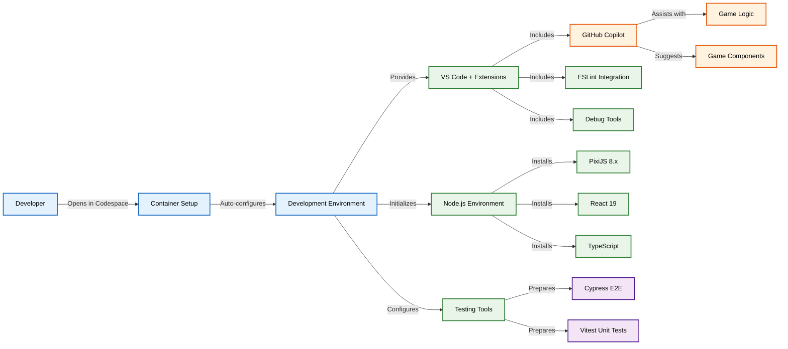
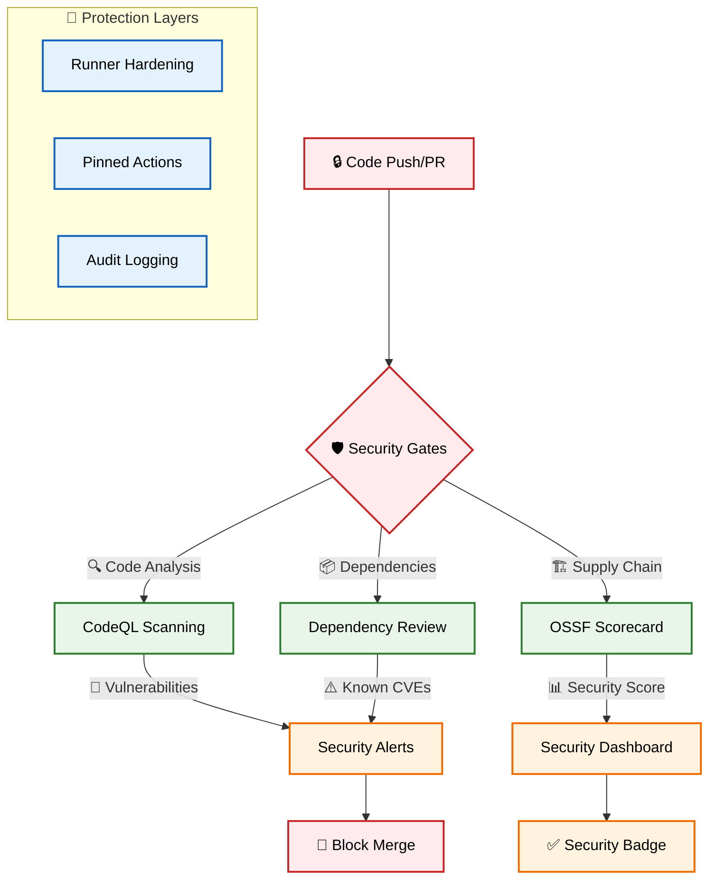
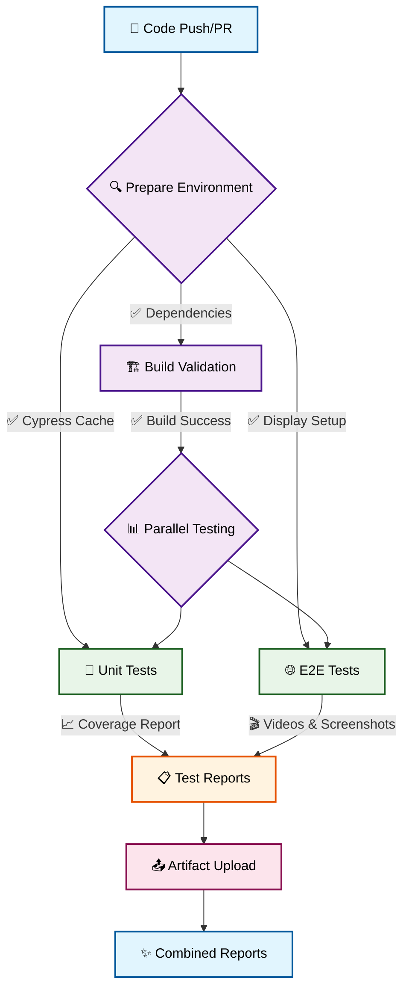
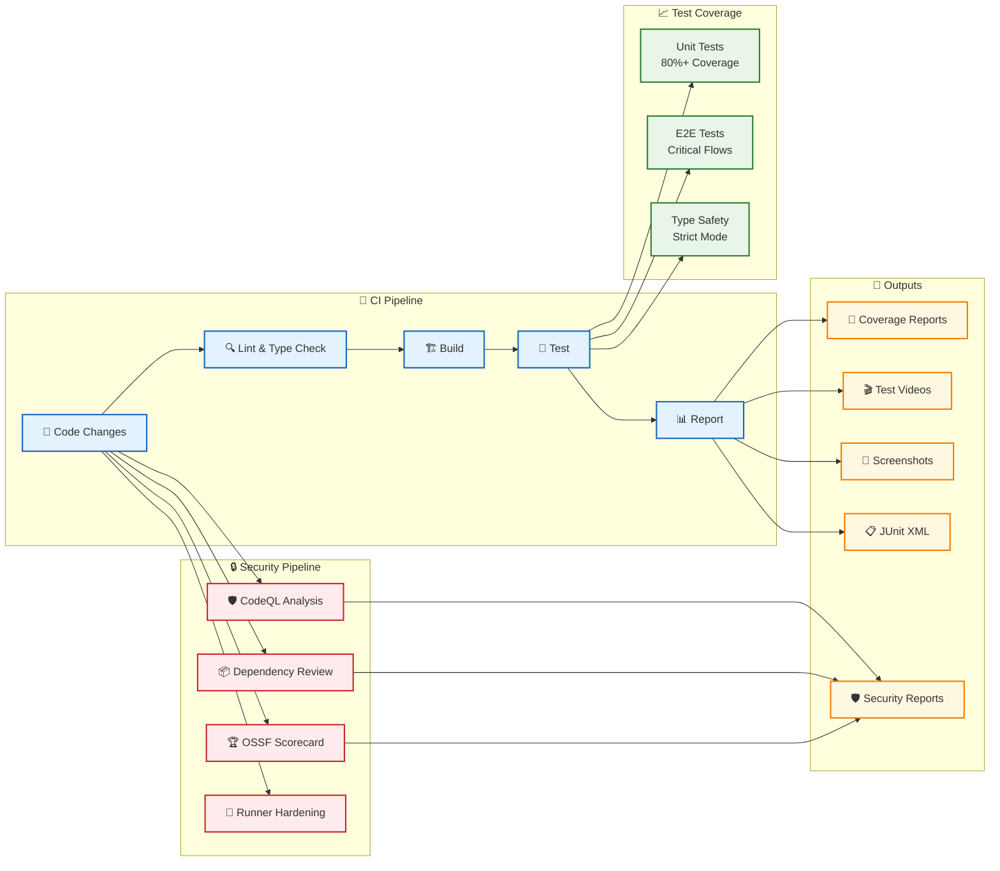

# Game Template

A clean, minimal template for building games with React, TypeScript, and Vite - built with **security-first principles**.

## Badges

[](https://github.com/Hack23/game/raw/master/LICENSE.md)
[](https://scorecard.dev/viewer/?uri=github.com/Hack23/game)

## 🔒 Security Features

This template implements comprehensive security measures:

- **🛡️ Supply Chain Security** - OSSF Scorecard analysis and dependency review
- **🔍 Static Analysis** - CodeQL scanning for vulnerabilities
- **📦 Dependency Protection** - Automated dependency vulnerability checks
- **🔐 Runner Hardening** - All CI/CD runners are hardened with audit logging
- **📋 Security Policies** - GitHub security advisories and vulnerability reporting
- **🏷️ Pinned Dependencies** - All GitHub Actions pinned to specific SHA hashes

## Features

- ⚡ **Vite** - Fast build tool and dev server
- ⚛️ **React 19** - Modern React with hooks
- 🔷 **TypeScript** - Strict typing with latest standards
- 🧪 **Vitest** - Fast unit testing with coverage
- 🌲 **Cypress** - Reliable E2E testing
- 📦 **ESLint** - Code linting with TypeScript rules
- 🔄 **GitHub Actions** - Automated testing and reporting
- 🎮 **PixiJS 8.x** - High-performance WebGL renderer for 2D games
- 🎵 **Howler.js** - Audio library for games

## Development Environment

This template includes a fully configured development environment:

- **🚀 GitHub Codespaces** - Zero-configuration development environment
- **🤖 GitHub Copilot** - AI-assisted development with code suggestions
- **💬 Copilot Chat** - In-editor AI assistance for debugging and explanations
- **🔧 VS Code Extensions** - Pre-configured extensions for game development
- **🔒 Secure Container** - Hardened development container with security features

### 🚀 Codespaces Setup

This repository is fully configured for GitHub Codespaces, providing:

- **One-click setup** - Start coding immediately with zero configuration
- **Pre-installed dependencies** - All tools and libraries ready to use
- **Configured test environment** - Cypress and Vitest ready to run
- **GitHub Copilot integration** - AI-powered code assistance
- **Optimized performance** - Container configured for game development



## Security Workflows



## Test & Report Workflow



## Quick Start

```bash
# Using GitHub Codespaces
# Click "Code" button on repository and select "Open with Codespaces"

# Or local development:
# Install dependencies
npm install

# Start development server
npm run dev

# Build for production
npm run build

# Run unit tests
npm run test

# Run E2E tests
npm run test:e2e
```

## PixiJS 8.x Integration

This template uses PixiJS 8.x for high-performance 2D game rendering:

- Modern WebGL-based rendering
- Optimized sprite batching
- Integrated with React via @pixi/react
- Sound support via @pixi/sound and Howler.js
- Responsive game canvas
- Touch and mouse input handling

Example game component:

```tsx
import { Stage, Sprite, useTick } from '@pixi/react';
import { useState } from 'react';

export function Game() {
  const [position, setPosition] = useState({ x: 100, y: 100 });
  
  useTick((delta) => {
    // Game logic here
    setPosition(prev => ({
      x: prev.x + delta,
      y: prev.y
    }));
  });
  
  return (
    <Stage width={800} height={600} options={{ backgroundColor: 0x1d2230 }}>
      <Sprite 
        image="/assets/character.png" 
        x={position.x} 
        y={position.y} 
        anchor={{ x: 0.5, y: 0.5 }}
      />
    </Stage>
  );
}
```

## Testing

### Unit Tests

- Uses Vitest with jsdom environment
- Configured for React Testing Library
- Coverage reports generated automatically
- Run with: `npm run test`

### E2E Tests

- Uses Cypress for end-to-end testing
- Starts dev server automatically
- Screenshots and videos on failure
- Run with: `npm run test:e2e`

### CI/CD Pipeline



### Security Workflows

- **CodeQL Analysis**: Automated vulnerability scanning on push/PR
- **Dependency Review**: Checks for known vulnerabilities in dependencies
- **OSSF Scorecard**: Supply chain security assessment with public scoring
- **Runner Hardening**: All CI/CD runners use hardened security policies

## Possible Future Project Structure

```
src/
├── test/           # Test setup and utilities
├── App.tsx         # Main application component
├── App.test.tsx    # Unit tests for App
├── main.tsx        # Application entry point
├── components/     # Game components
│   ├── Game.tsx    # Main game component with PixiJS Stage
│   └── UI/         # Game UI components
├── hooks/          # Custom React hooks
├── assets/         # Game assets (sprites, sounds)
└── index.css       # Global styles

cypress/
├── e2e/           # End-to-end test specs
└── support/       # Cypress support files

.devcontainer/     # GitHub Codespaces configuration
├── devcontainer.json  # Development container config
└── init-xvfb.sh      # Display server for Cypress

.github/
├── workflows/     # GitHub Actions workflows
│   ├── test-and-report.yml    # Main CI/CD pipeline
│   ├── codeql.yml            # Security code analysis
│   ├── dependency-review.yml  # Dependency vulnerability checks
│   └── scorecards.yml        # Supply chain security assessment
└── SECURITY.md    # Security policy and reporting
```

## Development Guidelines

- **Strict TypeScript** - Enable all strict options
- **Test Coverage** - Aim for 80%+ coverage
- **Component Testing** - Test critical user flows
- **Type Safety** - Avoid `any`, use explicit types
- **Security First** - All dependencies reviewed for vulnerabilities
- **Pinned Actions** - GitHub Actions pinned to specific SHA hashes
- **AI-Assisted** - Leverage GitHub Copilot for code generation and debugging

## Building Your Game

This template provides a **secure foundation** for game development:

1. Replace the counter example with your game logic
2. Add game-specific components in `src/components/`
3. Create game state management (Context API, Zustand, etc.)
4. Add unit tests for game logic
5. Create E2E tests for game flows
6. Deploy using the included **security-hardened** GitHub Actions

All security workflows will automatically protect your game from common vulnerabilities and supply chain attacks.

Happy gaming! 🎮🔒
