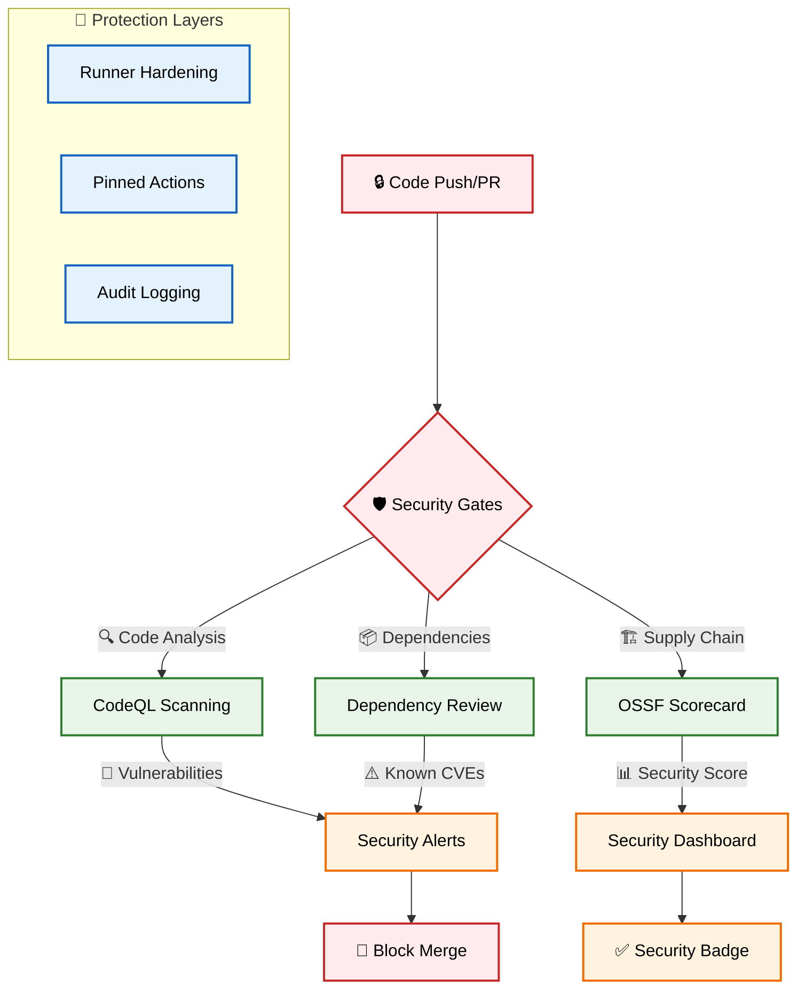
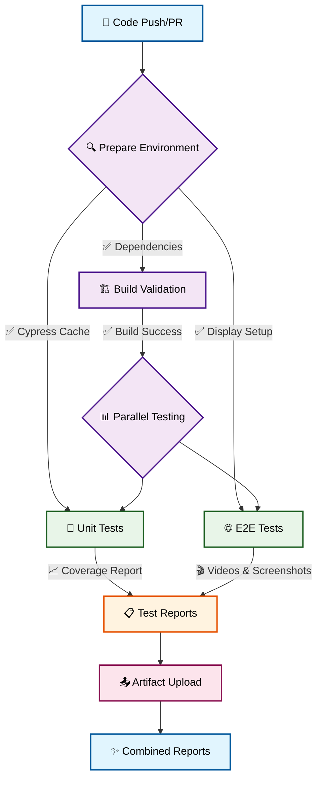
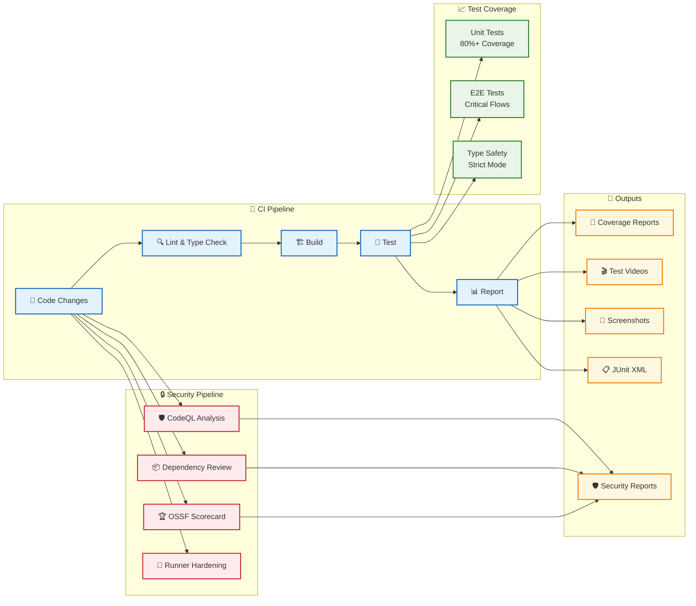

# Game Template

A clean, minimal template for building games with React, TypeScript, and Vite - built with **security-first principles**.

## 🔒 Security Features

This template implements comprehensive security measures:

- **🛡️ Supply Chain Security** - OSSF Scorecard analysis and dependency review
- **🔍 Static Analysis** - CodeQL scanning for vulnerabilities
- **📦 Dependency Protection** - Automated dependency vulnerability checks
- **🔐 Runner Hardening** - All CI/CD runners are hardened with audit logging
- **📋 Security Policies** - GitHub security advisories and vulnerability reporting
- **🏷️ Pinned Dependencies** - All GitHub Actions pinned to specific SHA hashes

## Features

- ⚡ **Vite** - Fast build tool and dev server
- ⚛️ **React 19** - Modern React with hooks
- 🔷 **TypeScript** - Strict typing with latest standards
- 🧪 **Vitest** - Fast unit testing with coverage
- 🌲 **Cypress** - Reliable E2E testing
- 📦 **ESLint** - Code linting with TypeScript rules
- 🔄 **GitHub Actions** - Automated testing and reporting

## Security Workflows



## Test & Report Workflow



## Quick Start

```bash
# Install dependencies
npm install

# Start development server
npm run dev

# Build for production
npm run build

# Run unit tests
npm run test

# Run E2E tests
npm run test:e2e:open
```

## Testing

### Unit Tests

- Uses Vitest with jsdom environment
- Configured for React Testing Library
- Coverage reports generated automatically
- Run with: `npm run test`

### E2E Tests

- Uses Cypress for end-to-end testing
- Starts dev server automatically
- Screenshots and videos on failure
- Run with: `npm run test:e2e`

### CI/CD Pipeline



### Security Workflows

- **CodeQL Analysis**: Automated vulnerability scanning on push/PR
- **Dependency Review**: Checks for known vulnerabilities in dependencies
- **OSSF Scorecard**: Supply chain security assessment with public scoring
- **Runner Hardening**: All CI/CD runners use hardened security policies

## Project Structure

```
src/
├── test/           # Test setup and utilities
├── App.tsx         # Main application component
├── App.test.tsx    # Unit tests for App
├── main.tsx        # Application entry point
└── index.css       # Global styles

cypress/
├── e2e/           # End-to-end test specs
└── support/       # Cypress support files

.github/
├── workflows/     # GitHub Actions workflows
│   ├── test-and-report.yml    # Main CI/CD pipeline
│   ├── codeql.yml            # Security code analysis
│   ├── dependency-review.yml  # Dependency vulnerability checks
│   └── scorecards.yml        # Supply chain security assessment
└── SECURITY.md    # Security policy and reporting
```

## Development Guidelines

- **Strict TypeScript** - Enable all strict options
- **Test Coverage** - Aim for 80%+ coverage
- **Component Testing** - Test critical user flows
- **Type Safety** - Avoid `any`, use explicit types
- **Security First** - All dependencies reviewed for vulnerabilities
- **Pinned Actions** - GitHub Actions pinned to specific SHA hashes

## Security Policy

This project follows responsible disclosure practices:

- **Vulnerability Reporting**: Use GitHub Security Advisories
- **Response Time**: Critical issues addressed within 24-48 hours
- **Dependencies**: Automatically monitored for known vulnerabilities
- **Supply Chain**: OSSF Scorecard provides transparency on security practices

## Building Your Game

This template provides a **secure foundation** for game development:

1. Replace the counter example with your game logic
2. Add game-specific components in `src/components/`
3. Create game state management (Context API, Zustand, etc.)
4. Add unit tests for game logic
5. Create E2E tests for game flows
6. Deploy using the included **security-hardened** GitHub Actions

All security workflows will automatically protect your game from common vulnerabilities and supply chain attacks.

Happy gaming! 🎮🔒
