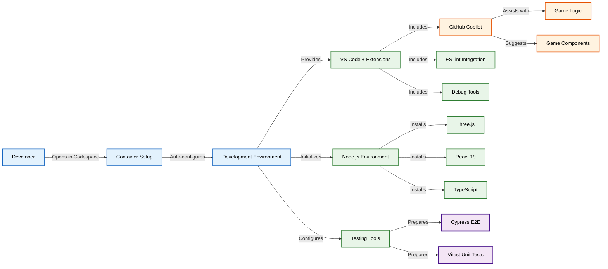
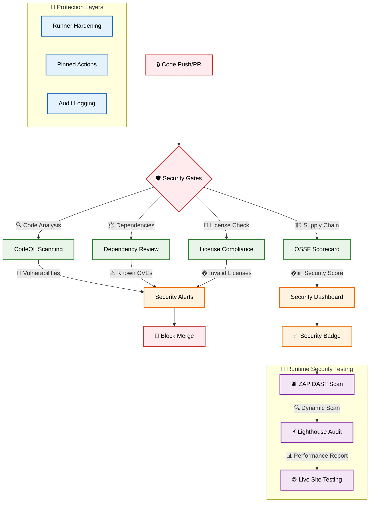
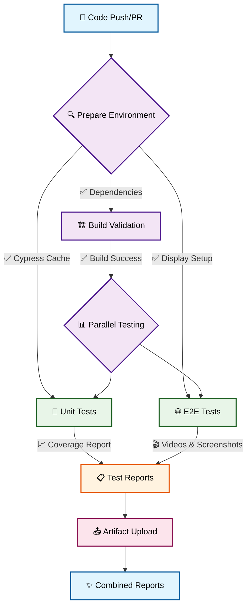
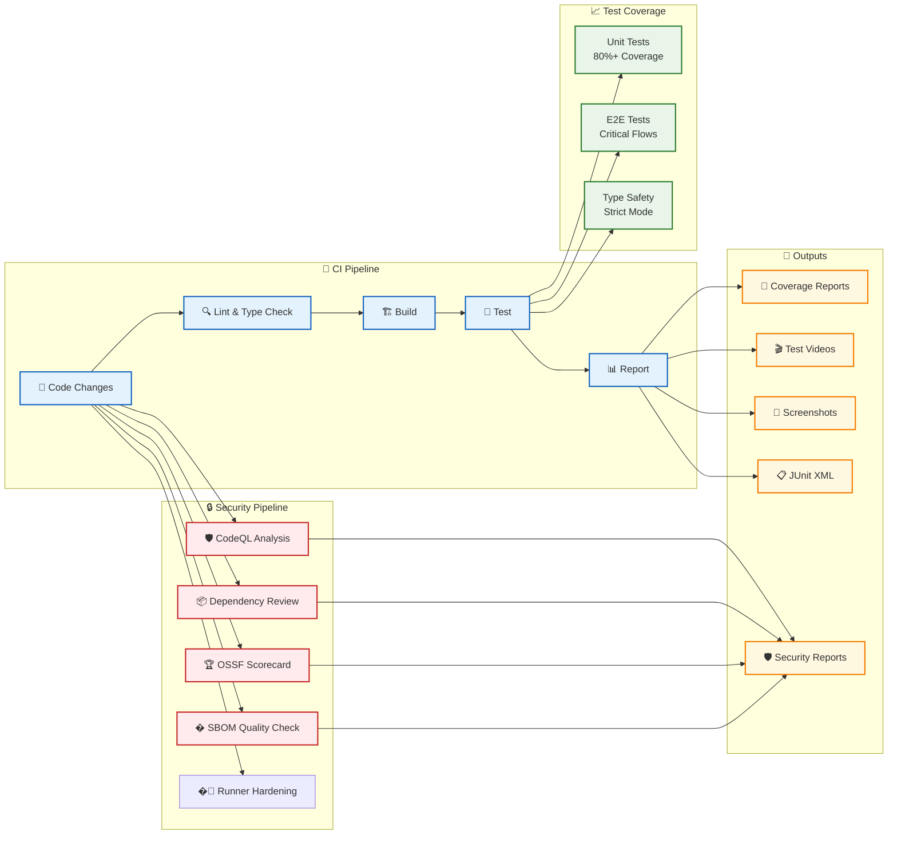
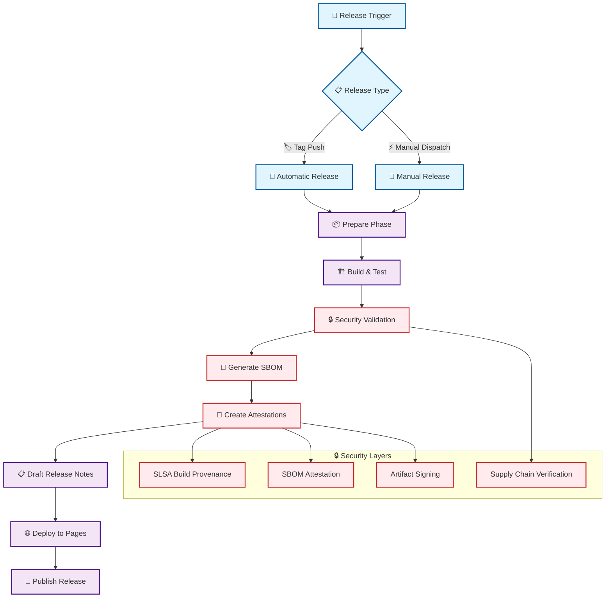
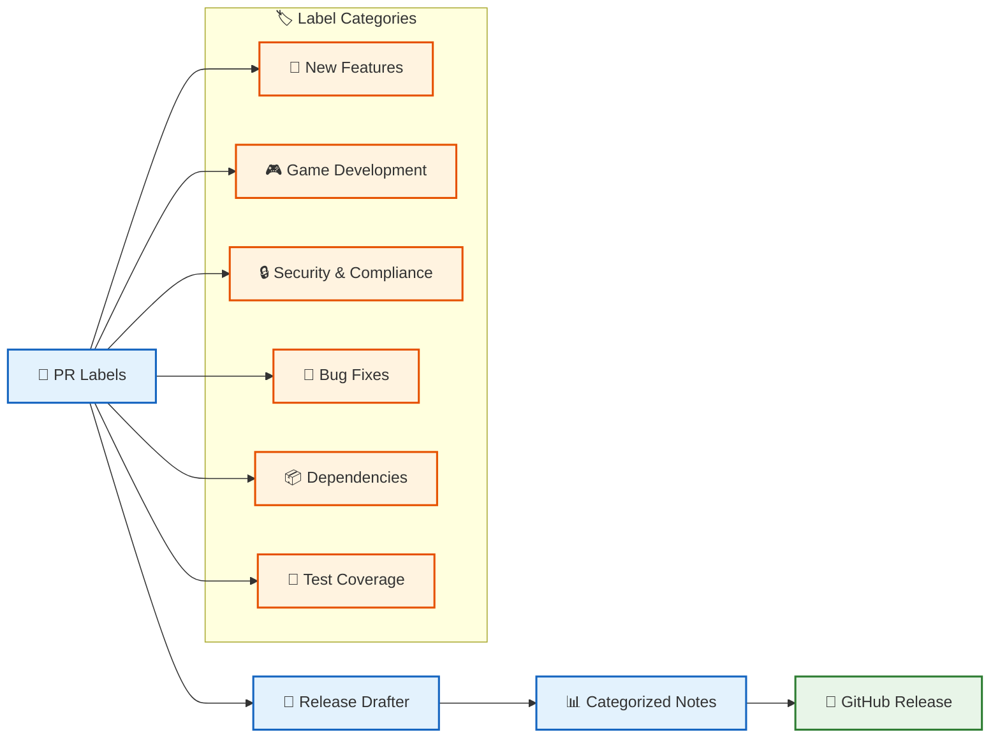
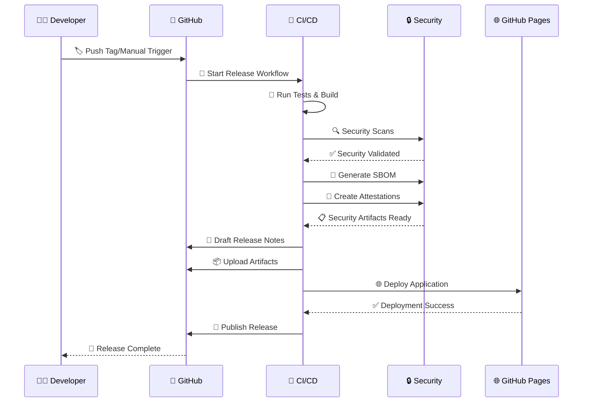

# Game Template

A clean, minimal template for building games with React, TypeScript, Three.js, and Vite - built with **security-first principles**.

## Badges

[](https://github.com/Hack23/game/raw/master/LICENSE.md)
[](https://scorecard.dev/viewer/?uri=github.com/Hack23/game)
[](https://deepwiki.com/Hack23/game)

## 🔒 Security Features

This template implements comprehensive security measures aligned with **[Hack23 AB's Information Security Management System (ISMS)](https://github.com/Hack23/ISMS-PUBLIC)**:

### 🛡️ Supply Chain Security
- **🛡️ OSSF Scorecard** - Automated supply chain security assessment ([Open Source Policy](https://github.com/Hack23/ISMS-PUBLIC/blob/main/Open_Source_Policy.md))
- **🔍 Static Analysis** - CodeQL scanning for vulnerabilities ([Secure Development Policy](https://github.com/Hack23/ISMS-PUBLIC/blob/main/Secure_Development_Policy.md))
- **📦 Dependency Protection** - Automated dependency vulnerability checks ([Open Source Policy](https://github.com/Hack23/ISMS-PUBLIC/blob/main/Open_Source_Policy.md))
- **📜 License Compliance** - Automated checking of dependency licenses (MIT, Apache-2.0, BSD variants, ISC, CC0-1.0, Unlicense) ([Open Source Policy](https://github.com/Hack23/ISMS-PUBLIC/blob/main/Open_Source_Policy.md))
- **📋 SBOM Quality Validation** - Automated SBOM quality scoring with minimum 7.0/10 threshold using SBOMQS ([Secure Development Policy](https://github.com/Hack23/ISMS-PUBLIC/blob/main/Secure_Development_Policy.md))
- **🔐 Runner Hardening** - All CI/CD runners are hardened with audit logging ([Secure Development Policy](https://github.com/Hack23/ISMS-PUBLIC/blob/main/Secure_Development_Policy.md))
- **📋 Security Policies** - GitHub security advisories and vulnerability reporting ([Information Security Policy](https://github.com/Hack23/ISMS-PUBLIC/blob/main/Information_Security_Policy.md))
- **🏷️ Pinned Dependencies** - All GitHub Actions pinned to specific SHA hashes ([Secure Development Policy](https://github.com/Hack23/ISMS-PUBLIC/blob/main/Secure_Development_Policy.md))

### 🔏 Build Integrity & Attestations
- **📄 SBOM Generation** - Software Bill of Materials for transparency ([Open Source Policy](https://github.com/Hack23/ISMS-PUBLIC/blob/main/Open_Source_Policy.md))
- **🔏 Build Attestations** - Cryptographic proof of build integrity ([Secure Development Policy](https://github.com/Hack23/ISMS-PUBLIC/blob/main/Secure_Development_Policy.md))
- **🛡️ Immutable Releases** - Artifacts cannot be tampered with ([Data Classification Policy](https://github.com/Hack23/ISMS-PUBLIC/blob/main/Data_Classification_Policy.md))
- **🔐 Build Integrity** - Original builds remain unchanged
- **📋 Audit Trail** - Complete release history
- **🏆 Artifact Verification** - SLSA-compliant build provenance

### 🧪 Security Testing
- **🕷️ ZAP Security Scanning** - OWASP ZAP dynamic application security testing ([Secure Development Policy](https://github.com/Hack23/ISMS-PUBLIC/blob/main/Secure_Development_Policy.md))
- **⚡ Lighthouse Performance** - Automated performance and accessibility audits ([Secure Development Policy](https://github.com/Hack23/ISMS-PUBLIC/blob/main/Secure_Development_Policy.md))

### 📚 Security Documentation
For complete security policy mapping and detailed compliance information, see:
- 📊 **[ISMS Policy Mapping](docs/ISMS_POLICY_MAPPING.md)** - Comprehensive feature-to-policy mapping
- 🔒 **[SECURITY.md](SECURITY.md)** - Security policy and vulnerability reporting
- 🔐 **[ISMS-PUBLIC Repository](https://github.com/Hack23/ISMS-PUBLIC)** - Complete ISMS documentation

## Features

- ⚡ **Vite** - Fast build tool and dev server
- ⚛️ **React 19** - Modern React with hooks
- 🔷 **TypeScript** - Strict typing with latest standards
- 🧪 **Vitest** - Fast unit testing with coverage
- 🌲 **Cypress** - Reliable E2E testing
- 📦 **ESLint** - Code linting with TypeScript rules
- 🔄 **GitHub Actions** - Automated testing and reporting
- 🎮 **Three.js** - High-performance 3D WebGL renderer
- 🎨 **@react-three/fiber** - React renderer for Three.js
- 🛠️ **@react-three/drei** - Useful helpers for react-three-fiber
- 🎵 **Howler.js** - Audio library for games

## 🤖 GitHub Copilot Custom Agents & Skills

This repository leverages GitHub Copilot's latest features for AI-assisted development:

### 🎯 Custom Agents (January 2026)
Specialized AI experts for different development tasks:

- **🎯 [product-task-agent](.github/agents/product-task-agent.md)** - Product analysis, quality improvement, and GitHub issue creation
- **🎮 [game-developer](.github/agents/game-developer.md)** - Three.js game development with @react-three/fiber and @react-three/drei
- **🎨 [frontend-specialist](.github/agents/frontend-specialist.md)** - React 19 and TypeScript UI development
- **🧪 [test-engineer](.github/agents/test-engineer.md)** - Comprehensive testing with Vitest and Cypress
- **🔒 [security-specialist](.github/agents/security-specialist.md)** - Security, compliance, and supply chain protection
- **📝 [documentation-writer](.github/agents/documentation-writer.md)** - Technical documentation and guides

### 🎓 Agent Skills (December 2025 - NEW!)
Reusable patterns and best practices that agents automatically apply:

- **🔒 [security-by-design](.github/skills/security-by-design/SKILL.md)** - High-level security principles and enforcement rules
- **📋 [isms-compliance](.github/skills/isms-compliance/SKILL.md)** - ISMS policy alignment verification
- **🎮 [react-threejs-game](.github/skills/react-threejs-game/SKILL.md)** - Three.js game development patterns
- **🧪 [testing-strategy](.github/skills/testing-strategy/SKILL.md)** - Comprehensive testing patterns
- **📝 [documentation-standards](.github/skills/documentation-standards/SKILL.md)** - Clear technical documentation
- **⚡ [performance-optimization](.github/skills/performance-optimization/SKILL.md)** - React and Three.js optimization

**Learn more:** [Custom Agents Documentation](.github/agents/README.md) | [Agent Skills Guide](.github/skills/README.md) | [Comprehensive Copilot Guide](.github/COPILOT_GUIDE.md)

## 🚀 Using This Template

When you create a new repository from this template, follow these essential setup steps to get all security and automation features working properly:

### 1. 📋 Setup Repository Labels

Labels are essential for automated pull request categorization and release note generation.

**Run the setup workflow:**

1. Go to **Actions** → **Setup Repository Labels**
2. Click **"Run workflow"**
3. Choose whether to recreate all labels (optional)
4. Wait for completion

This creates all necessary labels for:

- 🚀 Features and enhancements
- 🐛 Bug fixes
- 🎮 Game development (graphics, audio, game logic)
- 🔒 Security and compliance
- 📦 Dependencies and infrastructure

### 2. 🌐 Enable GitHub Pages Deployment

Enable GitHub Pages to automatically deploy your game when creating releases.

**Setup GitHub Pages:**

1. Go to **Settings** → **Pages**
2. Under **Source**, select **"GitHub Actions"**
3. Save the configuration

Your game will be automatically deployed to `https://your-username.github.io/your-repo-name/` when you run the release workflow.

### 3. 🔒 Update Security Badge

Update the OpenSSF Scorecard badge to point to your repository.

**Edit the README:**

```markdown
[](https://scorecard.dev/viewer/?uri=github.com/your-username/your-repo-name)
```

Replace `your-username/your-repo-name` with your actual GitHub repository path.

### 4. 🎮 Start Building Your Game

With the template configured, you can now:

1. **Develop locally or in Codespaces**

   ```bash
   npm install
   npm run dev
   ```

2. **Create pull requests** - Labels will be automatically applied
3. **Run tests** - Automated testing on every push/PR
4. **Create releases** - Use the release workflow for deployment
5. **Monitor security** - Automated security scanning and scoring

### 🔄 Available Workflows

Your repository includes these automated workflows:

| Workflow                         | Trigger          | Purpose                                                                                         |
| -------------------------------- | ---------------- | ----------------------------------------------------------------------------------------------- |
| **Setup Repository Labels**      | Manual           | Creates all required labels for PR categorization                                               |
| **Setup Copilot Environment**    | Manual           | Validates and documents Copilot MCP server configuration                                        |
| **Test and Report**              | Push/PR          | Runs unit tests, E2E tests, license compliance, SBOM quality validation, and generates coverage |
| **Build, Attest and Release**    | Manual/Tag       | Creates secure releases with SBOM, license validation, and attestations                         |
| **CodeQL Analysis**              | Push/PR/Schedule | Static code analysis for security vulnerabilities                                               |
| **Dependency Review**            | PR               | Reviews dependencies for known vulnerabilities                                                  |
| **Scorecard Analysis**           | Push/Schedule    | OSSF supply chain security assessment                                                           |
| **ZAP Security Scan**            | Manual           | Dynamic security testing of deployed app                                                        |
| **Lighthouse Performance**       | Manual           | Performance and accessibility audits                                                            |

### 🛡️ Security Features Ready to Use

Once configured, your repository automatically provides comprehensive security aligned with **[Hack23 AB's ISMS](https://github.com/Hack23/ISMS-PUBLIC)**:

- **🛡️ OSSF Scorecard** - Automated supply chain security assessment ([Open Source Policy](https://github.com/Hack23/ISMS-PUBLIC/blob/main/Open_Source_Policy.md))
- **🔍 Static Analysis** - CodeQL scanning for vulnerabilities ([Secure Development Policy](https://github.com/Hack23/ISMS-PUBLIC/blob/main/Secure_Development_Policy.md))
- **📦 Dependency Protection** - Automated dependency vulnerability checks ([Open Source Policy](https://github.com/Hack23/ISMS-PUBLIC/blob/main/Open_Source_Policy.md))
- **📜 License Compliance** - Automated checking of dependency licenses ([Open Source Policy](https://github.com/Hack23/ISMS-PUBLIC/blob/main/Open_Source_Policy.md))
- **📋 SBOM Quality Validation** - Automated SBOM quality scoring ([Secure Development Policy](https://github.com/Hack23/ISMS-PUBLIC/blob/main/Secure_Development_Policy.md))
- **🔐 Runner Hardening** - All CI/CD runners are hardened ([Secure Development Policy](https://github.com/Hack23/ISMS-PUBLIC/blob/main/Secure_Development_Policy.md))
- **📋 Security Policies** - GitHub security advisories and vulnerability reporting ([Information Security Policy](https://github.com/Hack23/ISMS-PUBLIC/blob/main/Information_Security_Policy.md))
- **🏷️ Pinned Dependencies** - All GitHub Actions pinned to specific SHA hashes ([Secure Development Policy](https://github.com/Hack23/ISMS-PUBLIC/blob/main/Secure_Development_Policy.md))
- **📄 SBOM Generation** - Software Bill of Materials for transparency ([Open Source Policy](https://github.com/Hack23/ISMS-PUBLIC/blob/main/Open_Source_Policy.md))
- **🔏 Build Attestations** - Cryptographic proof of build integrity ([Secure Development Policy](https://github.com/Hack23/ISMS-PUBLIC/blob/main/Secure_Development_Policy.md))
- **🛡️ Immutable Releases** - Artifacts cannot be tampered with ([Data Classification Policy](https://github.com/Hack23/ISMS-PUBLIC/blob/main/Data_Classification_Policy.md))
- **🔐 Build Integrity** - Original builds remain unchanged
- **📋 Audit Trail** - Complete release history
- **🏆 Artifact Verification** - SLSA-compliant build provenance
- **🕷️ ZAP Security Scanning** - OWASP ZAP dynamic application security testing ([Secure Development Policy](https://github.com/Hack23/ISMS-PUBLIC/blob/main/Secure_Development_Policy.md))
- **⚡ Lighthouse Performance** - Automated performance and accessibility audits ([Secure Development Policy](https://github.com/Hack23/ISMS-PUBLIC/blob/main/Secure_Development_Policy.md))

See **[ISMS Policy Mapping](docs/ISMS_POLICY_MAPPING.md)** for complete feature-to-policy mapping.

### 🎯 Next Steps

1. **Replace the example game** in `src/components/` with your game logic
2. **Add game assets** to the `public/assets/` directory
3. **Create your first PR** to see automated labeling in action
4. **Run your first release** to deploy to GitHub Pages
5. **Monitor security** through the automatically generated security reports

All security workflows will protect your game from vulnerabilities while providing complete transparency through attestations and SBOM generation.

## Development Environment

This template includes a fully configured development environment:

- **🚀 GitHub Codespaces** - Zero-configuration development environment
- **🤖 GitHub Copilot** - AI-assisted development with code suggestions
- **💬 Copilot Chat** - In-editor AI assistance for debugging and explanations
- **🔧 VS Code Extensions** - Pre-configured extensions for game development
- **🔒 Secure Container** - Hardened development container with security features
- **🔌 MCP Servers** - Model Context Protocol servers for enhanced Copilot capabilities

### 🚀 Codespaces Setup

This repository is fully configured for GitHub Codespaces, providing:

- **One-click setup** - Start coding immediately with zero configuration
- **Pre-installed dependencies** - All tools and libraries ready to use
- **Configured test environment** - Cypress and Vitest ready to run
- **GitHub Copilot integration** - AI-powered code assistance with MCP servers
- **Optimized performance** - Container configured for game development

### 🔌 MCP Servers for Enhanced Copilot

This repository is configured with Model Context Protocol (MCP) servers that enhance GitHub Copilot's capabilities:

- **🗂️ Filesystem Server** - Secure file access for code navigation and editing
- **🐙 GitHub Server** - Repository context, issues, and PR integration
- **📚 Git Server** - Version control history and code evolution understanding
- **🧠 Memory Server** - Maintains context across Copilot conversations
- **🔍 Brave Search Server** - Documentation search (optional, requires API key)
- **🎭 Playwright Server** - Browser automation for testing and debugging

**Configuration Files:**
- `.github/copilot-instructions.md` - Coding guidelines for Copilot
- `docs/MCP_CONFIGURATION.md` - Detailed MCP setup documentation

**Note:** MCP servers are automatically configured in the GitHub Codespaces environment and don't require separate configuration files.

**Learn More:** See [MCP Configuration Guide](docs/MCP_CONFIGURATION.md) for detailed setup and usage instructions.

### 🔑 Configuring GitHub Personal Access Token

The **product-task-agent** and **GitHub MCP server** require a Personal Access Token (PAT) to create and manage issues, access repository data, and perform other GitHub operations.

#### Creating a Personal Access Token

1. **Generate a Fine-Grained Token** (Recommended)
   - Go to **GitHub Settings** → **Developer settings** → **Personal access tokens** → **Fine-grained tokens**
   - Click **"Generate new token"**
   - Fill in the details:
     - **Token name**: `copilot-mcp-game` (or your preferred name)
     - **Expiration**: Choose an appropriate duration (e.g., 90 days)
     - **Repository access**: Select **"Only select repositories"** → Choose your game repository
   
   - **Repository permissions** (required):
     - **Issues**: Read and write (for creating and managing issues)
     - **Contents**: Read-only (for code analysis)
     - **Metadata**: Read-only (automatically included)
     - **Pull requests**: Read and write (optional, for PR management)
     - **Workflows**: Read-only (optional, for workflow status)
   
   - Click **"Generate token"** and **copy the token immediately** (you won't see it again)

2. **Alternative: Classic Token**
   - Go to **GitHub Settings** → **Developer settings** → **Personal access tokens** → **Tokens (classic)**
   - Click **"Generate new token"** → **"Generate new token (classic)"**
   - Select scopes:
     - ✅ `repo` (Full control of private repositories) - **Required**
     - ✅ `read:org` (Read org membership) - Optional
     - ✅ `workflow` (Update GitHub Actions workflows) - Optional
   - Click **"Generate token"** and **copy the token**

#### Setting the Token in Your Environment

**For GitHub Codespaces:**

1. Go to your repository on GitHub
2. Click **Settings** → **Secrets and variables** → **Codespaces**
3. Click **"New repository secret"**
4. Name: `GITHUB_TOKEN`
5. Value: Paste your Personal Access Token
6. Click **"Add secret"**

The token will be automatically available in your Codespace environment.

**For Local Development:**

```bash
# Linux/macOS - Add to ~/.bashrc or ~/.zshrc
export GITHUB_TOKEN="your_token_here"

# Windows PowerShell - Add to your PowerShell profile
$env:GITHUB_TOKEN="your_token_here"

# Windows Command Prompt
set GITHUB_TOKEN=your_token_here
```

**Verify the token is set:**
```bash
# In your terminal
echo $GITHUB_TOKEN  # Linux/macOS
echo %GITHUB_TOKEN% # Windows CMD
echo $env:GITHUB_TOKEN # Windows PowerShell
```

#### Required Permissions Summary

| Permission | Access Level | Purpose |
|------------|--------------|---------|
| **Issues** | Read and write | Create and manage GitHub issues via product-task-agent |
| **Contents** | Read-only | Analyze code and repository structure |
| **Metadata** | Read-only | Access repository metadata (automatic) |
| **Pull requests** | Read and write | Manage PRs (optional) |
| **Workflows** | Read-only | Check workflow status (optional) |

#### Security Best Practices

- ✅ **Use fine-grained tokens** with minimal required permissions
- ✅ **Set appropriate expiration** (90 days recommended)
- ✅ **Limit to specific repositories** rather than all repositories
- ✅ **Never commit tokens** to source code
- ✅ **Use repository secrets** for Codespaces
- ✅ **Rotate tokens regularly** before expiration
- ✅ **Revoke unused tokens** in GitHub settings

#### Troubleshooting

**Token not working:**
- Verify the token has the required permissions
- Check if the token has expired
- Ensure `GITHUB_TOKEN` environment variable is set correctly
- Restart your Codespace or terminal after setting the token

**Permission errors when creating issues:**
- Ensure token has **Issues: Read and write** permission
- Verify repository access includes your target repository
- Check token hasn't been revoked



## Security Workflows



## Test & Report Workflow



## Quick Start

```bash
# Using GitHub Codespaces
# Click "Code" button on repository and select "Open with Codespaces"

# Or local development:
# Install dependencies
npm install

# Start development server
npm run dev

# Build for production
npm run build

# Run unit tests
npm run test

# Run E2E tests
npm run test:e2e

# Check license compliance
npm run test:licenses
```

## Three.js Integration

This template uses Three.js for high-performance 3D game rendering:

- Modern WebGL-based 3D rendering
- Optimized performance with @react-three/fiber
- React integration via @react-three/fiber
- Useful helpers via @react-three/drei
- Sound support via Howler.js
- Responsive 3D canvas
- Touch and mouse input handling
- Camera controls with OrbitControls

Example game component:

```tsx
import { Canvas } from "@react-three/fiber";
import { OrbitControls } from "@react-three/drei";

export function Game() {
  return (
    <Canvas camera={{ position: [0, 2, 8], fov: 50 }}>
      {/* Lighting */}
      <ambientLight intensity={0.5} />
      <pointLight position={[10, 10, 10]} intensity={1} />

      {/* 3D Objects */}
      <mesh>
        <sphereGeometry args={[0.5, 32, 32]} />
        <meshStandardMaterial color="#00ff88" />
      </mesh>

      {/* Camera Controls */}
      <OrbitControls />
    </Canvas>
  );
}
```

## Testing

### Unit Tests

- Uses Vitest with jsdom environment
- Configured for React Testing Library
- Coverage reports generated automatically
- Run with: `npm run test`

### E2E Tests

- Uses Cypress for end-to-end testing
- Starts dev server automatically
- Screenshots and videos on failure
- Run with: `npm run test:e2e`

### License Compliance

- Automated checking of dependency licenses using `license-compliance`
- Only allows approved open-source licenses (MIT, Apache-2.0, BSD variants, ISC, CC0-1.0, Unlicense)
- Prevents dependencies with restrictive or unknown licenses
- Run with: `npm run test:licenses`

### SBOM Quality Validation

- Automated SBOM quality assessment using [SBOMQS](https://github.com/interlynk-io/sbomqs) during CI/CD builds
- Validates SBOM completeness across multiple standards (NTIA-minimum-elements, BSI v1.1/v2.0, Semantic, Quality, Sharing, Structural)
- Enforces minimum quality score of **7.0/10** to ensure high-quality Software Bill of Materials
- Checks for essential components: names, versions, unique IDs, suppliers, licenses, checksums, and dependency relationships
- Blocks builds with insufficient SBOM quality to maintain supply chain transparency
- Provides detailed quality reports with actionable feedback for improvement

### CI/CD Pipeline



### Security Workflows

- **CodeQL Analysis**: Automated vulnerability scanning on push/PR
- **Dependency Review**: Checks for known vulnerabilities in dependencies
- **License Compliance**: Validates all dependencies use approved open-source licenses
- **SBOM Quality Validation**: Automated SBOM quality assessment using SBOMQS with minimum 7.0/10 score requirement
- **OSSF Scorecard**: Supply chain security assessment with public scoring
- **Runner Hardening**: All CI/CD runners use hardened security policies

## 🚀 Release Management

This template includes a comprehensive, security-first release workflow with automated versioning, security attestations, and deployment.

### Release Flow



### 🏷️ Release Types

#### Automatic Releases (Tag-based)

```bash
# Create and push a tag to trigger automatic release
git tag v1.0.0
git push origin v1.0.0
```

#### Manual Releases (Workflow Dispatch)

- Navigate to **Actions** → **Build, Attest and Release**
- Click **Run workflow**
- Specify version (e.g., `v1.0.1`) and pre-release status
- The workflow handles version bumping and tagging automatically

### 📋 Automated Release Notes

Release notes are automatically generated using semantic labeling:



#### Release Note Categories

- **🚀 New Features** - Major feature additions
- **🎮 Game Development** - Game logic, graphics, audio improvements
- **🎨 UI/UX Improvements** - Interface and design updates
- **🏗️ Infrastructure & Performance** - Build and performance optimizations
- **🔄 Code Quality & Refactoring** - Code improvements and testing
- **🔒 Security & Compliance** - Security updates and fixes
- **📝 Documentation** - Documentation improvements
- **📦 Dependencies** - Dependency updates
- **🐛 Bug Fixes** - Bug fixes and patches

### 🔒 Security Attestations & SBOM

#### Software Bill of Materials (SBOM)

Every release includes a comprehensive SBOM in SPDX format:

```json
{
  "SPDXID": "SPDXRef-DOCUMENT",
  "name": "game-v1.0.0",
  "packages": [
    {
      "SPDXID": "SPDXRef-Package-react",
      "name": "react",
      "versionInfo": "19.1.0",
      "licenseConcluded": "MIT"
    }
  ]
}
```

#### Build Provenance Attestations

SLSA-compliant build attestations provide cryptographic proof:

```json
{
  "_type": "https://in-toto.io/Statement/v0.1",
  "predicateType": "https://slsa.dev/provenance/v0.2",
  "subject": [
    {
      "name": "game-v1.0.0.zip",
      "digest": {
        "sha256": "abc123..."
      }
    }
  ],
  "predicate": {
    "builder": {
      "id": "https://github.com/actions/runner"
    },
    "buildType": "https://github.com/actions/workflow@v1"
  }
}
```

#### Verification Commands

```bash
# Verify build provenance
gh attestation verify game-v1.0.0.zip \
  --owner Hack23 --repo game

# Verify SBOM attestation
gh attestation verify game-v1.0.0.zip \
  --owner Hack23 --repo game \
  --predicate-type https://spdx.dev/Document
```

# 🔒 Immutable Releases

This repository uses **GitHub's immutable releases** to prevent unauthorized modifications to published releases.

## What are Immutable Releases?

Immutable releases lock release artifacts after publication, ensuring:

- **🛡️ Supply Chain Security** - Artifacts cannot be tampered with
- **🔐 Build Integrity** - Original builds remain unchanged
- **📋 Audit Trail** - Complete release history

> Only release title and notes can be modified after publication.

## How to Enable

### For Your Repository:

1. Go to **Settings** → **General**
2. Scroll to the **"Releases"** section
3. Check **"Enable release immutability"**
4. ⚠️ Only applies to **future releases**

### For Your Organization:

1. Go to **Organization Settings** → **Repository** → **General**
2. In **"Releases"** section, select policy:
   - **All repositories** - Apply to all org repos
   - **Selected repositories** - Choose specific repos
3. ⚠️ Only applies to **future releases**

## Verification

```bash
# Verify release artifacts haven't been tampered with
gh attestation verify game-v1.1.4.zip --owner Hack23 --repo game
```

---

_Part of our security-first approach alongside OSSF Scorecard, SLSA attestations, and automated scanning._

### 📦 Release Artifacts

Each release includes multiple artifacts with full traceability:

```
📦 Release v1.0.0
├── 🎮 game-v1.0.0.zip                    # Built application
├── 📄 game-v1.0.0.spdx.json             # Software Bill of Materials
├── 🔏 game-v1.0.0.zip.intoto.jsonl      # Build provenance attestation
└── 📋 game-v1.0.0.spdx.json.intoto.jsonl # SBOM attestation
```

### 🌐 Deployment Pipeline



### 🔐 Security Compliance

#### OSSF Scorecard Integration

- **Automated scoring** of supply chain security practices
- **Public transparency** with security badge
- **Continuous monitoring** of security posture

#### Supply Chain Protection

- **Pinned dependencies** - All GitHub Actions pinned to SHA hashes
- **Dependency scanning** - Automated vulnerability detection
- **SLSA compliance** - Build integrity and provenance
- **Signed artifacts** - Cryptographic verification of releases

### 📊 Release Metrics

Track release quality and security with built-in metrics:

- **🔒 Security Score** - OSSF Scorecard rating
- **📈 Test Coverage** - Unit and E2E test coverage
- **🏷️ Vulnerability Count** - Known security issues
- **📦 Dependency Health** - Outdated/vulnerable dependencies
- **🚀 Build Success Rate** - CI/CD pipeline reliability

## Building Your Game

This template provides a **secure foundation** for game development:

1. Replace the counter example with your game logic
2. Add game-specific components in `src/components/`
3. Create game state management (Context API, Zustand, etc.)
4. Add unit tests for game logic
5. Create E2E tests for game flows
6. **Create releases** using the automated workflow
7. **Monitor security** through OSSF Scorecard and attestations
8. Deploy using the included **security-hardened** GitHub Actions

All security workflows will automatically protect your game from common vulnerabilities and supply chain attacks, while providing full transparency through SBOM and attestations.

## 📚 Documentation

### Development Guides
- **[Copilot Quick Start Guide](docs/COPILOT_QUICK_START.md)** - Get started with GitHub Copilot in this repository
- **[MCP Configuration Guide](docs/MCP_CONFIGURATION.md)** - Model Context Protocol setup and usage
- **[MCP Architecture](docs/MCP_ARCHITECTURE.md)** - Visual guide to MCP integration
- **[Copilot Instructions](.github/copilot-instructions.md)** - Coding guidelines for AI assistance

### Security & Compliance
- 🔒 **[SECURITY.md](SECURITY.md)** - Security policy and vulnerability reporting
- 🛡️ **[SECURITY_HEADERS.md](SECURITY_HEADERS.md)** - Security headers implementation
- 📊 **[ISMS Policy Mapping](docs/ISMS_POLICY_MAPPING.md)** - Complete feature-to-policy mapping
- 🔐 **[ISMS-PUBLIC Repository](https://github.com/Hack23/ISMS-PUBLIC)** - Hack23 AB's complete ISMS

### ISMS Core Policies
- 🔐 **[Information Security Policy](https://github.com/Hack23/ISMS-PUBLIC/blob/main/Information_Security_Policy.md)** - Overall security governance
- 🛠️ **[Secure Development Policy](https://github.com/Hack23/ISMS-PUBLIC/blob/main/Secure_Development_Policy.md)** - SDLC and CI/CD requirements
- 📦 **[Open Source Policy](https://github.com/Hack23/ISMS-PUBLIC/blob/main/Open_Source_Policy.md)** - Supply chain security
- 🏷️ **[Data Classification Policy](https://github.com/Hack23/ISMS-PUBLIC/blob/main/Data_Classification_Policy.md)** - Data handling requirements
- 🔒 **[Privacy Policy](https://github.com/Hack23/ISMS-PUBLIC/blob/main/Privacy_Policy.md)** - Privacy and GDPR compliance
- 🔑 **[Access Control Policy](https://github.com/Hack23/ISMS-PUBLIC/blob/main/Access_Control_Policy.md)** - Authentication and authorization

Happy gaming! 🎮🔒
