# Game Template

A clean, minimal template for building games with React, TypeScript, and Vite.

## Features

- ⚡ **Vite** - Fast build tool and dev server
- ⚛️ **React 19** - Modern React with hooks
- 🔷 **TypeScript** - Strict typing with latest standards
- 🧪 **Vitest** - Fast unit testing with coverage
- 🌲 **Cypress** - Reliable E2E testing
- 📦 **ESLint** - Code linting with TypeScript rules
- 🔄 **GitHub Actions** - Automated testing and reporting

## Test & Report Workflow

```mermaid
graph TD
    A[🚀 Code Push/PR] --> B{🔍 Prepare Environment}

    B --> |✅ Dependencies| C[🏗️ Build Validation]
    B --> |✅ Cypress Cache| D[🧪 Unit Tests]
    B --> |✅ Display Setup| E[🌐 E2E Tests]

    C --> |✅ Build Success| F{📊 Parallel Testing}

    F --> D
    F --> E

    D --> |📈 Coverage Report| G[📋 Test Reports]
    E --> |🎬 Videos & Screenshots| G

    G --> H[📤 Artifact Upload]
    H --> I[✨ Combined Reports]

    %% Styling
    classDef startEnd fill:#e1f5fe,stroke:#01579b,stroke-width:2px,color:#000
    classDef process fill:#f3e5f5,stroke:#4a148c,stroke-width:2px,color:#000
    classDef test fill:#e8f5e8,stroke:#1b5e20,stroke-width:2px,color:#000
    classDef report fill:#fff3e0,stroke:#e65100,stroke-width:2px,color:#000
    classDef artifact fill:#fce4ec,stroke:#880e4f,stroke-width:2px,color:#000

    class A,I startEnd
    class B,C,F process
    class D,E test
    class G,H report
    class H artifact
```



## Quick Start

```bash
# Install dependencies
npm install

# Start development server
npm run dev

# Build for production
npm run build

# Run unit tests
npm run test

# Run E2E tests
npm run test:e2e
```

## Testing

### Unit Tests

- Uses Vitest with jsdom environment
- Configured for React Testing Library
- Coverage reports generated automatically
- Run with: `npm run test`

### E2E Tests

- Uses Cypress for end-to-end testing
- Starts dev server automatically
- Screenshots and videos on failure
- Run with: `npm run test:e2e`

### CI/CD Pipeline

```mermaid
flowchart LR
    subgraph "🔧 CI Pipeline"
        A1[📝 Code Changes] --> A2[🔍 Lint & Type Check]
        A2 --> A3[🏗️ Build]
        A3 --> A4[🧪 Test]
        A4 --> A5[📊 Report]
    end

    subgraph "📈 Test Coverage"
        B1[Unit Tests<br/>80%+ Coverage]
        B2[E2E Tests<br/>Critical Flows]
        B3[Type Safety<br/>Strict Mode]
    end

    subgraph "🎯 Outputs"
        C1[📄 Coverage Reports]
        C2[🎬 Test Videos]
        C3[📸 Screenshots]
        C4[📋 JUnit XML]
    end

    A4 --> B1
    A4 --> B2
    A4 --> B3

    A5 --> C1
    A5 --> C2
    A5 --> C3
    A5 --> C4

    %% Styling
    classDef pipeline fill:#e3f2fd,stroke:#1565c0,stroke-width:2px
    classDef testing fill:#e8f5e8,stroke:#2e7d32,stroke-width:2px
    classDef output fill:#fff8e1,stroke:#f57c00,stroke-width:2px

    class A1,A2,A3,A4,A5 pipeline
    class B1,B2,B3 testing
    class C1,C2,C3,C4 output
```



### GitHub Actions Workflow

- **Prepare**: Sets up Node.js, caches dependencies, verifies Cypress
- **Build Validation**: Ensures code compiles and builds successfully
- **Unit Tests**: Runs Vitest with coverage reporting (80%+ threshold)
- **E2E Tests**: Executes Cypress tests with video/screenshot capture
- **Report**: Combines all artifacts and generates unified test reports

## Project Structure

```
src/
├── test/           # Test setup and utilities
├── App.tsx         # Main application component
├── App.test.tsx    # Unit tests for App
├── main.tsx        # Application entry point
└── index.css       # Global styles

cypress/
├── e2e/           # End-to-end test specs
└── support/       # Cypress support files

.github/
└── workflows/     # GitHub Actions workflows
```

## Development Guidelines

- **Strict TypeScript** - Enable all strict options
- **Test Coverage** - Aim for 80%+ coverage
- **Component Testing** - Test critical user flows
- **Type Safety** - Avoid `any`, use explicit types

## Building Your Game

This template provides a solid foundation for game development:

1. Replace the counter example with your game logic
2. Add game-specific components in `src/components/`
3. Create game state management (Context API, Zustand, etc.)
4. Add unit tests for game logic
5. Create E2E tests for game flows
6. Deploy using the included GitHub Actions

Happy gaming! 🎮
