  

<h1 align="center">📊 Hack23 AB — ISMS Policy Mapping for Game Template</h1>

  <strong>🛡️ Complete Feature-to-Policy Mapping</strong> 
  <em>🎯 Demonstrating transparency, security excellence, and compliance alignment</em>

  
  
  
  

**📋 Document Owner:** CEO | **📄 Version:** 1.0 | **📅 Last Updated:** 2025-11-10 (UTC)  
**🔄 Review Cycle:** Quarterly | **⏰ Next Review:** 2026-02-10

---

## 🎯 Purpose

> *"At Hack23 AB, we believe in radical transparency. This mapping demonstrates how every security feature in our game template aligns with our comprehensive Information Security Management System (ISMS), providing verifiable evidence of our commitment to security excellence."*
> 
> — **James Pether Sörling**, CEO, Hack23 AB

This document provides a comprehensive mapping between the Hack23 AB game template features, security controls, and the publicly available ISMS policies. This mapping enables:

- **🔍 Transparency** - Clear traceability from implementation to policy
- **✅ Verification** - Auditable evidence of security compliance
- **📚 Education** - Understanding security requirements and their implementation
- **🤝 Trust** - Demonstrating commitment to security best practices

---

## 📋 Core ISMS Policy References

### 🔐 Security Foundation Policies

| Policy | Purpose | Link |
|--------|---------|------|
| 🔐 **Information Security Policy** | Overarching security governance and principles | [View Policy](https://github.com/Hack23/ISMS-PUBLIC/blob/main/Information_Security_Policy.md) |
| 🛠️ **Secure Development Policy** | SDLC, testing, deployment, and CI/CD requirements | [View Policy](https://github.com/Hack23/ISMS-PUBLIC/blob/main/Secure_Development_Policy.md) |
| 📦 **Open Source Policy** | Open source usage, license compliance, supply chain security | [View Policy](https://github.com/Hack23/ISMS-PUBLIC/blob/main/Open_Source_Policy.md) |
| 🏷️ **Data Classification Policy** | Data sensitivity levels, handling requirements | [View Policy](https://github.com/Hack23/ISMS-PUBLIC/blob/main/Data_Classification_Policy.md) |
| 🔒 **Privacy Policy** | Personal data protection, GDPR compliance | [View Policy](https://github.com/Hack23/ISMS-PUBLIC/blob/main/Privacy_Policy.md) |
| 🔑 **Access Control Policy** | Authentication, authorization, identity management | [View Policy](https://github.com/Hack23/ISMS-PUBLIC/blob/main/Access_Control_Policy.md) |

---

## 🎮 Game Template Feature to Policy Mapping

### 🛡️ Supply Chain Security

| Feature | Implementation | ISMS Policy Reference | Evidence |
|---------|---------------|----------------------|----------|
| **OSSF Scorecard** | Automated supply chain security assessment | [Open Source Policy](https://github.com/Hack23/ISMS-PUBLIC/blob/main/Open_Source_Policy.md) [Secure Development Policy](https://github.com/Hack23/ISMS-PUBLIC/blob/main/Secure_Development_Policy.md) |  |
| **Dependency Review** | Automated dependency vulnerability checks | [Open Source Policy](https://github.com/Hack23/ISMS-PUBLIC/blob/main/Open_Source_Policy.md) | [Dependency Review Workflow](../.github/workflows/dependency-review.yml) |
| **License Compliance** | Automated checking of dependency licenses | [Open Source Policy](https://github.com/Hack23/ISMS-PUBLIC/blob/main/Open_Source_Policy.md) | `npm run test:licenses` |
| **SBOM Generation** | Software Bill of Materials for transparency | [Open Source Policy](https://github.com/Hack23/ISMS-PUBLIC/blob/main/Open_Source_Policy.md) [Secure Development Policy](https://github.com/Hack23/ISMS-PUBLIC/blob/main/Secure_Development_Policy.md) | SPDX format in releases |
| **SBOM Quality Validation** | Automated SBOM quality scoring (min 7.0/10) | [Secure Development Policy](https://github.com/Hack23/ISMS-PUBLIC/blob/main/Secure_Development_Policy.md) | SBOMQS validation in CI |
| **Pinned Dependencies** | All GitHub Actions pinned to SHA hashes | [Secure Development Policy](https://github.com/Hack23/ISMS-PUBLIC/blob/main/Secure_Development_Policy.md) | `../.github/workflows/*.yml` |

### 🔍 Static and Dynamic Analysis

| Feature | Implementation | ISMS Policy Reference | Evidence |
|---------|---------------|----------------------|----------|
| **CodeQL Scanning** | Static code analysis for vulnerabilities | [Secure Development Policy](https://github.com/Hack23/ISMS-PUBLIC/blob/main/Secure_Development_Policy.md) [Information Security Policy](https://github.com/Hack23/ISMS-PUBLIC/blob/main/Information_Security_Policy.md) | [CodeQL Workflow](../.github/workflows/codeql.yml) |
| **ZAP Security Scanning** | OWASP ZAP dynamic application security testing | [Secure Development Policy](https://github.com/Hack23/ISMS-PUBLIC/blob/main/Secure_Development_Policy.md) | [ZAP Workflow](../.github/workflows/zap-scan.yml) |
| **ESLint** | Code quality and security linting | [Secure Development Policy](https://github.com/Hack23/ISMS-PUBLIC/blob/main/Secure_Development_Policy.md) | `npm run lint` |

### 🧪 Testing and Quality Assurance

| Feature | Implementation | ISMS Policy Reference | Evidence |
|---------|---------------|----------------------|----------|
| **Unit Testing** | Vitest with 80%+ coverage requirement | [Secure Development Policy](https://github.com/Hack23/ISMS-PUBLIC/blob/main/Secure_Development_Policy.md) | `npm run test` |
| **E2E Testing** | Cypress end-to-end testing | [Secure Development Policy](https://github.com/Hack23/ISMS-PUBLIC/blob/main/Secure_Development_Policy.md) | `npm run test:e2e` |
| **Coverage Reporting** | Automated coverage reports in CI/CD | [Secure Development Policy](https://github.com/Hack23/ISMS-PUBLIC/blob/main/Secure_Development_Policy.md) | Vitest coverage reports |
| **Lighthouse Audits** | Performance and accessibility audits | [Secure Development Policy](https://github.com/Hack23/ISMS-PUBLIC/blob/main/Secure_Development_Policy.md) | [Lighthouse Workflow](../.github/workflows/lighthouse-performance.yml) |

### 🔏 Build Integrity and Attestations

| Feature | Implementation | ISMS Policy Reference | Evidence |
|---------|---------------|----------------------|----------|
| **Build Attestations** | SLSA-compliant build provenance | [Secure Development Policy](https://github.com/Hack23/ISMS-PUBLIC/blob/main/Secure_Development_Policy.md) [Information Security Policy](https://github.com/Hack23/ISMS-PUBLIC/blob/main/Information_Security_Policy.md) | `gh attestation verify` |
| **Immutable Releases** | Release artifacts cannot be tampered with | [Secure Development Policy](https://github.com/Hack23/ISMS-PUBLIC/blob/main/Secure_Development_Policy.md) [Data Classification Policy](https://github.com/Hack23/ISMS-PUBLIC/blob/main/Data_Classification_Policy.md) | GitHub release settings |
| **Artifact Signing** | Cryptographic proof of build integrity | [Secure Development Policy](https://github.com/Hack23/ISMS-PUBLIC/blob/main/Secure_Development_Policy.md) | Build attestations |

### 🔐 Security Infrastructure

| Feature | Implementation | ISMS Policy Reference | Evidence |
|---------|---------------|----------------------|----------|
| **Runner Hardening** | All CI/CD runners hardened with audit logging | [Secure Development Policy](https://github.com/Hack23/ISMS-PUBLIC/blob/main/Secure_Development_Policy.md) [Access Control Policy](https://github.com/Hack23/ISMS-PUBLIC/blob/main/Access_Control_Policy.md) | [Workflow configurations](../.github/workflows/) |
| **Security Advisories** | GitHub security advisories and vulnerability reporting | [Information Security Policy](https://github.com/Hack23/ISMS-PUBLIC/blob/main/Information_Security_Policy.md) | [SECURITY.md](../SECURITY.md) |
| **Security Policies** | Documented security practices and reporting | [Information Security Policy](https://github.com/Hack23/ISMS-PUBLIC/blob/main/Information_Security_Policy.md) | [SECURITY.md](../SECURITY.md) |

### 👥 Development Environment

| Feature | Implementation | ISMS Policy Reference | Evidence |
|---------|---------------|----------------------|----------|
| **GitHub Codespaces** | Secure, hardened development environment | [Secure Development Policy](https://github.com/Hack23/ISMS-PUBLIC/blob/main/Secure_Development_Policy.md) [Access Control Policy](https://github.com/Hack23/ISMS-PUBLIC/blob/main/Access_Control_Policy.md) | [.devcontainer](../.devcontainer/) |
| **GitHub Copilot** | AI-assisted development with security guidelines | [Secure Development Policy](https://github.com/Hack23/ISMS-PUBLIC/blob/main/Secure_Development_Policy.md) | [copilot-instructions.md](../.github/copilot-instructions.md) |
| **Custom Agents** | Specialized agents including security specialist | [Secure Development Policy](https://github.com/Hack23/ISMS-PUBLIC/blob/main/Secure_Development_Policy.md) | [.github/agents](../.github/agents/) |

### 🏷️ Data Classification

| Feature | Implementation | ISMS Policy Reference | Evidence |
|---------|---------------|----------------------|----------|
| **Public Repository** | All code and documentation publicly accessible | [Data Classification Policy](https://github.com/Hack23/ISMS-PUBLIC/blob/main/Data_Classification_Policy.md) [Privacy Policy](https://github.com/Hack23/ISMS-PUBLIC/blob/main/Privacy_Policy.md) | GitHub public repository |
| **No Sensitive Data** | Template contains no sensitive or personal data | [Privacy Policy](https://github.com/Hack23/ISMS-PUBLIC/blob/main/Privacy_Policy.md) [Data Classification Policy](https://github.com/Hack23/ISMS-PUBLIC/blob/main/Data_Classification_Policy.md) | Repository audit |

---

## 🔄 CI/CD Pipeline Mapping

### Security Gate Enforcement

```mermaid
graph TD
    A[🚀 Code Push/PR] --> B{🛡️ Security Gates}
    
    B -->|🔍 SAST| C[CodeQL Analysis]
    B -->|📦 SCA| D[Dependency Review]
    B -->|📜 License| E[License Compliance]
    B -->|🏗️ Supply Chain| F[OSSF Scorecard]
    B -->|📋 SBOM| G[SBOM Quality Check]
    
    C -->|Vulnerabilities?| H{Block?}
    D -->|CVEs?| H
    E -->|Invalid License?| H
    F -->|Low Score?| H
    G -->|Quality < 7.0?| H
    
    H -->|Yes| I[🚫 Merge Blocked]
    H -->|No| J[✅ Merge Allowed]
    
    J --> K[🧪 Test Suite]
    K --> L[🏗️ Build]
    L --> M[🔏 Attest]
    M --> N[📦 Release]
    
    style A fill:#e3f2fd,stroke:#1565c0,stroke-width:2px
    style B fill:#fff3e0,stroke:#ef6c00,stroke-width:2px
    style C fill:#e8f5e8,stroke:#2e7d32,stroke-width:2px
    style D fill:#e8f5e8,stroke:#2e7d32,stroke-width:2px
    style E fill:#e8f5e8,stroke:#2e7d32,stroke-width:2px
    style F fill:#e8f5e8,stroke:#2e7d32,stroke-width:2px
    style G fill:#e8f5e8,stroke:#2e7d32,stroke-width:2px
    style H fill:#fff3e0,stroke:#ef6c00,stroke-width:2px
    style I fill:#ffebee,stroke:#c62828,stroke-width:2px
    style J fill:#e8f5e8,stroke:#2e7d32,stroke-width:2px
    style K fill:#e3f2fd,stroke:#1565c0,stroke-width:2px
    style L fill:#e3f2fd,stroke:#1565c0,stroke-width:2px
    style M fill:#f3e5f5,stroke:#7b1fa2,stroke-width:2px
    style N fill:#e8f5e8,stroke:#2e7d32,stroke-width:2px
```

**Policy Alignment:**
- 🔍 **SAST (CodeQL)** → [Secure Development Policy](https://github.com/Hack23/ISMS-PUBLIC/blob/main/Secure_Development_Policy.md)
- 📦 **SCA (Dependency Review)** → [Open Source Policy](https://github.com/Hack23/ISMS-PUBLIC/blob/main/Open_Source_Policy.md)
- 📜 **License Compliance** → [Open Source Policy](https://github.com/Hack23/ISMS-PUBLIC/blob/main/Open_Source_Policy.md)
- 🏗️ **Supply Chain (OSSF)** → [Open Source Policy](https://github.com/Hack23/ISMS-PUBLIC/blob/main/Open_Source_Policy.md)
- 📋 **SBOM Quality** → [Secure Development Policy](https://github.com/Hack23/ISMS-PUBLIC/blob/main/Secure_Development_Policy.md)
- 🔏 **Attestations** → [Secure Development Policy](https://github.com/Hack23/ISMS-PUBLIC/blob/main/Secure_Development_Policy.md)

---

## 📊 Compliance Framework Alignment

### ISO 27001:2022 Controls

| Control | Description | Game Template Implementation | ISMS Policy |
|---------|-------------|------------------------------|-------------|
| **A.8.29** | Security in development and support processes | CI/CD security gates, CodeQL, dependency scanning | [Secure Development Policy](https://github.com/Hack23/ISMS-PUBLIC/blob/main/Secure_Development_Policy.md) |
| **A.8.30** | Outsourced development | Open source dependency management, license compliance | [Open Source Policy](https://github.com/Hack23/ISMS-PUBLIC/blob/main/Open_Source_Policy.md) |
| **A.8.31** | Separation of development, test and production environments | Branch protection, environment-specific configurations | [Secure Development Policy](https://github.com/Hack23/ISMS-PUBLIC/blob/main/Secure_Development_Policy.md) |
| **A.8.32** | Change management | Automated testing, PR reviews, protected branches | [Secure Development Policy](https://github.com/Hack23/ISMS-PUBLIC/blob/main/Secure_Development_Policy.md) |
| **A.5.23** | Information security for use of cloud services | GitHub infrastructure, secure Codespaces | [Information Security Policy](https://github.com/Hack23/ISMS-PUBLIC/blob/main/Information_Security_Policy.md) |

### NIST Cybersecurity Framework 2.0

| Function | Category | Game Template Implementation | ISMS Policy |
|----------|----------|------------------------------|-------------|
| **IDENTIFY** | Asset Management (ID.AM) | SBOM generation, dependency inventory | [Open Source Policy](https://github.com/Hack23/ISMS-PUBLIC/blob/main/Open_Source_Policy.md) |
| **PROTECT** | Protective Technology (PR.PT) | Secure coding, input validation, type safety | [Secure Development Policy](https://github.com/Hack23/ISMS-PUBLIC/blob/main/Secure_Development_Policy.md) |
| **DETECT** | Security Continuous Monitoring (DE.CM) | CodeQL, dependency review, OSSF Scorecard | [Secure Development Policy](https://github.com/Hack23/ISMS-PUBLIC/blob/main/Secure_Development_Policy.md) |
| **RESPOND** | Analysis (RS.AN) | Security advisories, vulnerability reporting | [Information Security Policy](https://github.com/Hack23/ISMS-PUBLIC/blob/main/Information_Security_Policy.md) |
| **RECOVER** | Recovery Planning (RC.RP) | Immutable releases, version control | [Secure Development Policy](https://github.com/Hack23/ISMS-PUBLIC/blob/main/Secure_Development_Policy.md) |

### CIS Controls v8.1

| Control | Description | Game Template Implementation | ISMS Policy |
|---------|-------------|------------------------------|-------------|
| **2** | Inventory and Control of Software Assets | SBOM, dependency tracking | [Open Source Policy](https://github.com/Hack23/ISMS-PUBLIC/blob/main/Open_Source_Policy.md) |
| **16** | Application Software Security | SAST, DAST, secure coding practices | [Secure Development Policy](https://github.com/Hack23/ISMS-PUBLIC/blob/main/Secure_Development_Policy.md) |
| **18** | Penetration Testing | ZAP security scanning | [Secure Development Policy](https://github.com/Hack23/ISMS-PUBLIC/blob/main/Secure_Development_Policy.md) |

---

## 🎯 Using This Mapping

### For Developers

1. **Understand Requirements**: Reference the appropriate ISMS policy before implementing features
2. **Security by Design**: Use the mapping to ensure security controls are built-in
3. **Testing**: Follow testing requirements outlined in [Secure Development Policy](https://github.com/Hack23/ISMS-PUBLIC/blob/main/Secure_Development_Policy.md)
4. **Dependencies**: Review [Open Source Policy](https://github.com/Hack23/ISMS-PUBLIC/blob/main/Open_Source_Policy.md) before adding dependencies

### For Auditors

1. **Traceability**: Each security control links to implementation and policy
2. **Evidence**: All claims are backed by verifiable evidence (badges, workflows, reports)
3. **Compliance**: Framework alignment demonstrates regulatory compliance
4. **Verification**: Use provided links to audit actual implementations

### For Security Teams

1. **Risk Assessment**: Understand what security controls are in place
2. **Gap Analysis**: Identify areas where additional controls may be needed
3. **Incident Response**: Reference [Information Security Policy](https://github.com/Hack23/ISMS-PUBLIC/blob/main/Information_Security_Policy.md) for procedures
4. **Vulnerability Management**: Follow [Secure Development Policy](https://github.com/Hack23/ISMS-PUBLIC/blob/main/Secure_Development_Policy.md) requirements

---

## 📚 Related Documents

---

## 📚 Related Documents

### Internal Documentation
- 📖 [README.md](../README.md) - Project overview and quick start
- 🔒 [SECURITY.md](../SECURITY.md) - Security policy and vulnerability reporting
- 🛡️ [Security Headers](../SECURITY_HEADERS.md) - Security headers implementation
- 🤖 [Copilot Instructions](../.github/copilot-instructions.md) - Secure coding guidelines
- 🎮 [Custom Agents](../.github/agents/README.md) - Specialized development agents
- 🔐 [Security Specialist Agent](../.github/agents/security-specialist.md) - Security expert agent

### ISMS-PUBLIC Core Policies
- 🔐 [Information Security Policy](https://github.com/Hack23/ISMS-PUBLIC/blob/main/Information_Security_Policy.md) - Overall security governance
- 🛠️ [Secure Development Policy](https://github.com/Hack23/ISMS-PUBLIC/blob/main/Secure_Development_Policy.md) - SDLC and CI/CD requirements
- 📦 [Open Source Policy](https://github.com/Hack23/ISMS-PUBLIC/blob/main/Open_Source_Policy.md) - Supply chain security
- 🏷️ [Data Classification Policy](https://github.com/Hack23/ISMS-PUBLIC/blob/main/Data_Classification_Policy.md) - Data handling requirements
- 🔒 [Privacy Policy](https://github.com/Hack23/ISMS-PUBLIC/blob/main/Privacy_Policy.md) - Privacy and GDPR compliance
- 🔑 [Access Control Policy](https://github.com/Hack23/ISMS-PUBLIC/blob/main/Access_Control_Policy.md) - Authentication and authorization
- 🏷️ [Classification Framework](https://github.com/Hack23/ISMS-PUBLIC/blob/main/CLASSIFICATION.md) - CIA triad and impact levels

---

**📋 Document Control:**  
**✅ Approved by:** James Pether Sörling, CEO  
**📤 Distribution:** Public  
**🏷️ Classification:**   
**📅 Effective Date:** 2025-11-10  
**⏰ Next Review:** 2026-02-10  
**🎯 Framework Compliance:**    

---

*Part of Hack23 AB's commitment to transparency and security excellence*

