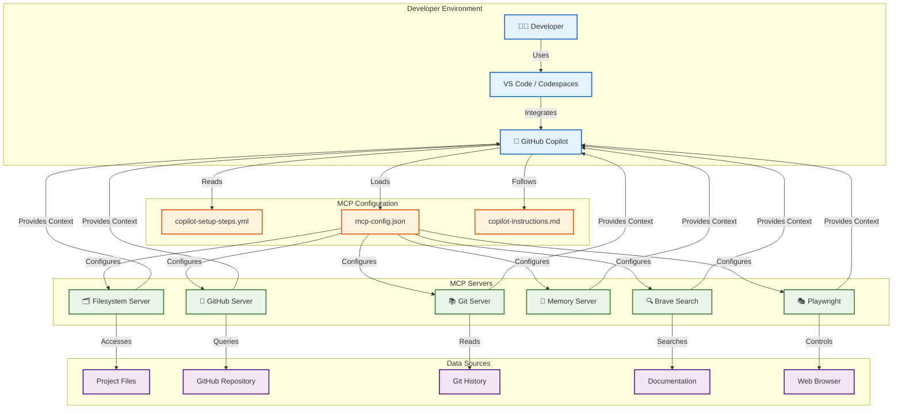
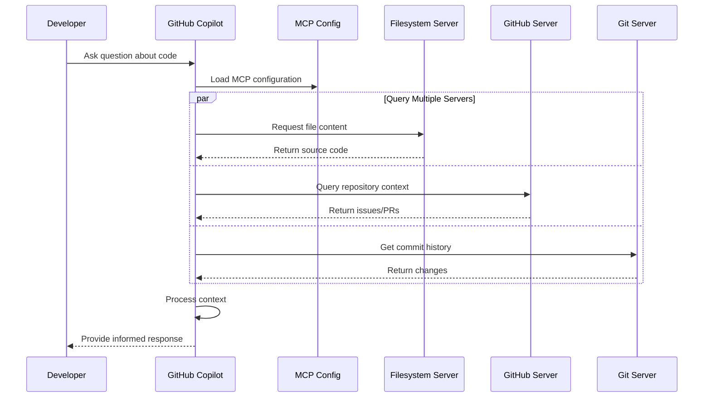
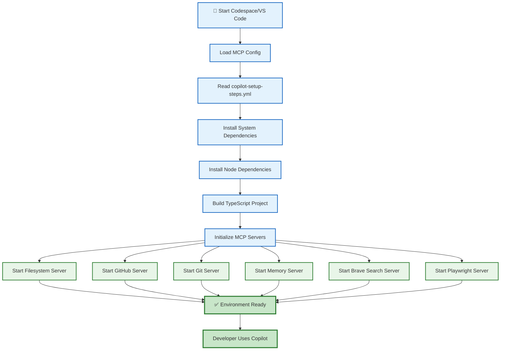
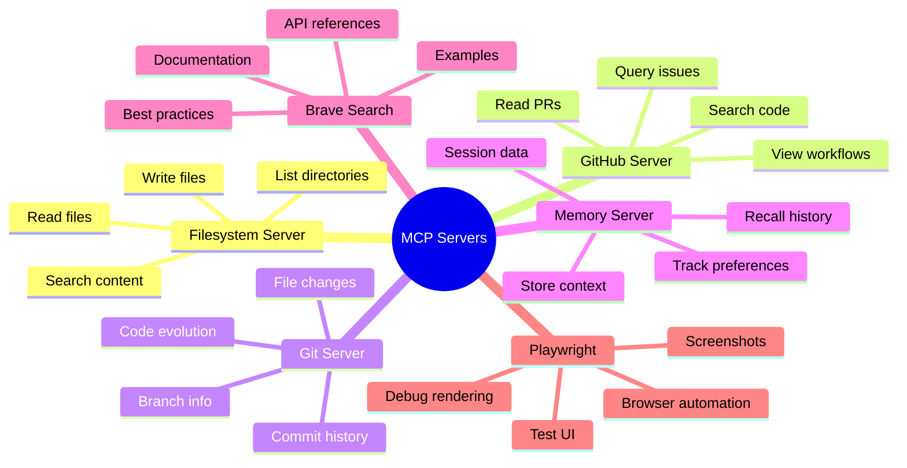
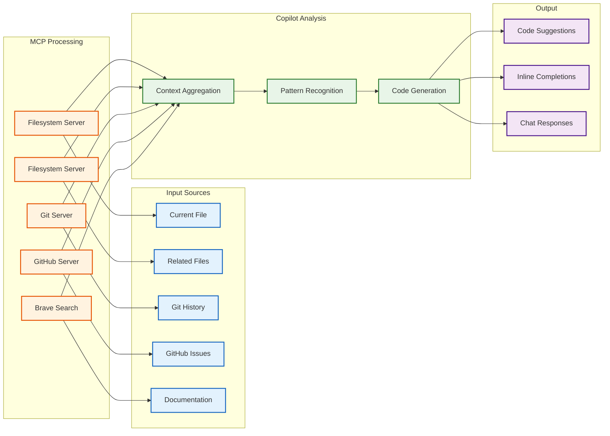
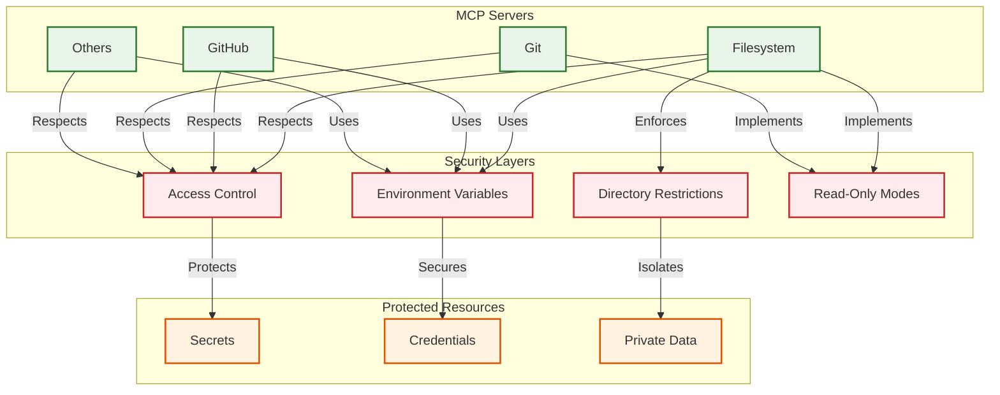
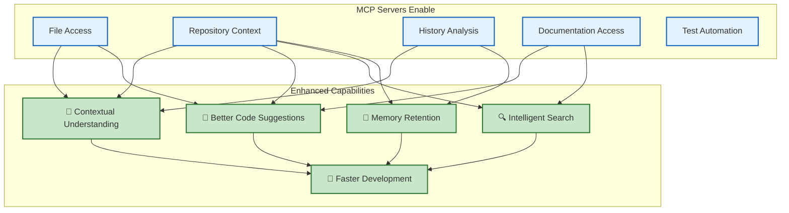

# Copilot MCP Architecture

This document visualizes how Model Context Protocol (MCP) servers integrate with GitHub Copilot in this repository.

## Architecture Overview



## MCP Server Interaction Flow



## Setup and Initialization Flow



## MCP Server Capabilities



## Data Flow for Code Suggestions



## Security Model



## Configuration Hierarchy

```
.github/
├── copilot-setup-steps.yml     # Main setup configuration
│   ├── System dependencies
│   ├── Node.js setup
│   ├── MCP server list
│   ├── Environment variables
│   └── Validation steps
│
├── mcp-config.json             # Standard MCP configuration
│   ├── Server definitions
│   ├── Command configurations
│   ├── Environment mappings
│   └── Enable/disable flags
│
├── copilot-instructions.md     # Coding guidelines
│   ├── TypeScript rules
│   ├── React patterns
│   ├── PixiJS conventions
│   └── Testing requirements
│
└── workflows/
    └── copilot-setup.yml       # Setup validation workflow
        ├── Installation tests
        ├── Configuration checks
        └── Documentation generation
```

## Integration Points

| Component | Configuration | Purpose |
|-----------|--------------|---------|
| **VS Code** | Uses `mcp-config.json` | Loads MCP servers automatically |
| **Codespaces** | Uses `devcontainer.json` | Pre-configures environment |
| **Copilot Agent** | Reads `copilot-setup-steps.yml` | Pre-installs dependencies |
| **GitHub Actions** | Executes `copilot-setup.yml` | Validates configuration |
| **Documentation** | References all configs | Guides developers |

## Benefits of MCP Integration



## See Also

- [MCP Configuration Guide](MCP_CONFIGURATION.md)
- [Copilot Quick Start](COPILOT_QUICK_START.md)
- [Copilot Instructions](../.github/copilot-instructions.md)
