# Copilot MCP Architecture

This document visualizes how Model Context Protocol (MCP) servers integrate with GitHub Copilot in this repository.

## Architecture Overview

```mermaid
graph TB
    subgraph "Developer Environment"
        Dev[👨‍💻 Developer]
        VSCode[VS Code / Codespaces]
        Copilot[🤖 GitHub Copilot]
    end

    subgraph "MCP Configuration"
        SetupSteps[copilot-setup-steps.yml]
        MCPConfig[mcp-config.json]
        Instructions[copilot-instructions.md]
    end

    subgraph "MCP Servers"
        FS[🗂️ Filesystem Server]
        GH[🐙 GitHub Server]
        Git[📚 Git Server]
        Mem[🧠 Memory Server]
        Search[🔍 Brave Search]
        PW[🎭 Playwright]
    end

    subgraph "Data Sources"
        Files[Project Files]
        Repo[GitHub Repository]
        History[Git History]
        Docs[Documentation]
        Browser[Web Browser]
    end

    Dev -->|Uses| VSCode
    VSCode -->|Integrates| Copilot
    Copilot -->|Reads| SetupSteps
    Copilot -->|Loads| MCPConfig
    Copilot -->|Follows| Instructions

    MCPConfig -->|Configures| FS
    MCPConfig -->|Configures| GH
    MCPConfig -->|Configures| Git
    MCPConfig -->|Configures| Mem
    MCPConfig -->|Configures| Search
    MCPConfig -->|Configures| PW

    FS -->|Accesses| Files
    GH -->|Queries| Repo
    Git -->|Reads| History
    Search -->|Searches| Docs
    PW -->|Controls| Browser

    FS -->|Provides Context| Copilot
    GH -->|Provides Context| Copilot
    Git -->|Provides Context| Copilot
    Mem -->|Provides Context| Copilot
    Search -->|Provides Context| Copilot
    PW -->|Provides Context| Copilot

    classDef primary fill:#e3f2fd,stroke:#1565c0,stroke-width:2px
    classDef config fill:#fff3e0,stroke:#e65100,stroke-width:2px
    classDef server fill:#e8f5e8,stroke:#2e7d32,stroke-width:2px
    classDef data fill:#f3e5f5,stroke:#4a148c,stroke-width:2px

    class Dev,VSCode,Copilot primary
    class SetupSteps,MCPConfig,Instructions config
    class FS,GH,Git,Mem,Search,PW server
    class Files,Repo,History,Docs,Browser data
```



## MCP Server Interaction Flow


## Setup and Initialization Flow

```mermaid
flowchart TD
    Start[🚀 Start Codespace/VS Code] --> LoadConfig[Load MCP Config]
    LoadConfig --> ReadSetup[Read copilot-setup-steps.yml]
    ReadSetup --> InstallDeps[Install System Dependencies]
    InstallDeps --> InstallNode[Install Node Dependencies]
    InstallNode --> BuildProject[Build TypeScript Project]
    BuildProject --> InitServers[Initialize MCP Servers]
    
    InitServers --> FSServer[Start Filesystem Server]
    InitServers --> GHServer[Start GitHub Server]
    InitServers --> GitServer[Start Git Server]
    InitServers --> MemServer[Start Memory Server]
    InitServers --> SearchServer[Start Brave Search Server]
    InitServers --> PWServer[Start Playwright Server]
    
    FSServer --> Ready
    GHServer --> Ready
    GitServer --> Ready
    MemServer --> Ready
    SearchServer --> Ready
    PWServer --> Ready
    
    Ready[✅ Environment Ready] --> UseCopilot[Developer Uses Copilot]
    
    classDef setup fill:#e3f2fd,stroke:#1565c0,stroke-width:2px
    classDef server fill:#e8f5e8,stroke:#2e7d32,stroke-width:2px
    classDef ready fill:#c8e6c9,stroke:#2e7d32,stroke-width:3px
    
    class Start,LoadConfig,ReadSetup,InstallDeps,InstallNode,BuildProject,InitServers setup
    class FSServer,GHServer,GitServer,MemServer,SearchServer,PWServer server
    class Ready,UseCopilot ready
```



## MCP Server Capabilities


## Data Flow for Code Suggestions


## Security Model


## Configuration Hierarchy

```
.github/
├── copilot-setup-steps.yml     # Main setup configuration
│   ├── System dependencies
│   ├── Node.js setup
│   ├── MCP server list
│   ├── Environment variables
│   └── Validation steps
│
├── mcp-config.json             # Standard MCP configuration
│   ├── Server definitions
│   ├── Command configurations
│   ├── Environment mappings
│   └── Enable/disable flags
│
├── copilot-instructions.md     # Coding guidelines
│   ├── TypeScript rules
│   ├── React patterns
│   ├── PixiJS conventions
│   └── Testing requirements
│
└── workflows/
    └── copilot-setup.yml       # Setup validation workflow
        ├── Installation tests
        ├── Configuration checks
        └── Documentation generation
```

## Integration Points

| Component | Configuration | Purpose |
|-----------|--------------|---------|
| **VS Code** | Uses `mcp-config.json` | Loads MCP servers automatically |
| **Codespaces** | Uses `devcontainer.json` | Pre-configures environment |
| **Copilot Agent** | Reads `copilot-setup-steps.yml` | Pre-installs dependencies |
| **GitHub Actions** | Executes `copilot-setup.yml` | Validates configuration |
| **Documentation** | References all configs | Guides developers |

## Benefits of MCP Integration

```mermaid
graph TB
    subgraph "Enhanced Capabilities"
        A1[🎯 Contextual Understanding]
        A2[📝 Better Code Suggestions]
        A3[🔍 Intelligent Search]
        A4[🧠 Memory Retention]
        A5[🚀 Faster Development]
    end

    subgraph "MCP Servers Enable"
        B1[File Access]
        B2[Repository Context]
        B3[History Analysis]
        B4[Documentation Access]
        B5[Test Automation]
    end

    B1 --> A1
    B2 --> A1
    B3 --> A1

    B1 --> A2
    B2 --> A2
    B4 --> A2

    B4 --> A3
    B2 --> A3

    B3 --> A4
    B2 --> A4

    A1 --> A5
    A2 --> A5
    A3 --> A5
    A4 --> A5

    classDef benefit fill:#c8e6c9,stroke:#2e7d32,stroke-width:2px
    classDef capability fill:#e3f2fd,stroke:#1565c0,stroke-width:2px

    class A1,A2,A3,A4,A5 benefit
    class B1,B2,B3,B4,B5 capability
```



## See Also

- [MCP Configuration Guide](MCP_CONFIGURATION.md)
- [Copilot Quick Start](COPILOT_QUICK_START.md)
- [Copilot Instructions](../.github/copilot-instructions.md)
